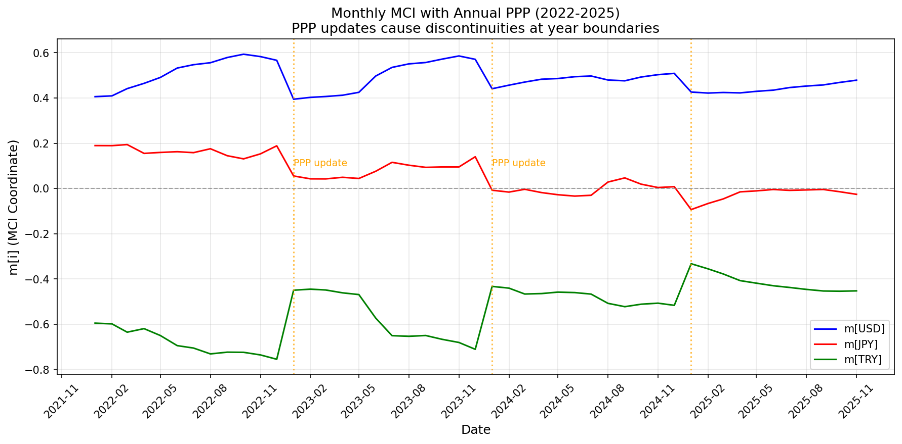

# 第8章 月次分析とPPP更新頻度の影響

## 8.1 月次観測の意義

第4章では年次データに基づく長期的な構造変化を分析した。以下に再掲する20年間のグラフ（図8.0）は、2011年の円高ピーク、2018年のトルコリラ危機、2022年のドル高局面という大きな構造変化を捉えている。


*図8.0: 年次MCI座標の推移（第4章より再掲）。20年間の長期トレンドは把握できるが、直近数年の詳細な動態は読み取りにくい。*

しかし、実際の市場参加者にとっては、より短い時間軸での変動を捉えることが重要である。上図では2022年以降の動きが圧縮されており、月次の動態を分析するには不十分である。本章では2022年から2025年にかけての月次データを用い、MCI座標の短期的な動態を分析する。

月次観測により、以下の点が明らかになる：

1. 年次データでは平滑化されてしまう短期的なストレスの蓄積・解消過程
2. 市場イベントに対する構造的な反応速度
3. レジーム転換の兆候となる先行的な動き

---

## 8.2 年単位PPPによる月次MCI

以下の図は、2022年1月から2025年11月までの月次MCI座標を示したものである。PPPは各年の確定値（IMF WEO）を使用している。



*図8.1: 年単位PPPを用いた月次MCI座標の推移。オレンジの点線は年境界（PPP更新タイミング）を示す。*

### 観察される特徴

このグラフから、いくつかの重要な特徴が読み取れる：

**1. 年境界での不連続性（軸のずれ）**

オレンジの点線で示された年境界において、MCI座標が急激にジャンプしている。**これは為替レートが急変動したわけではなく、MCI算出の基準となるPPP値（評価の「軸」）が年次更新されたことによる見かけ上の変化である。**

特に顕著なのは：
- **2023年1月**: m[TRY]が約-0.75から-0.45へ急上昇（+0.30）
- **2024年1月**: m[TRY]が約-0.71から-0.43へ急上昇（+0.28）

これらのジャンプは、トルコの高インフレを反映してIMFがPPP基準値を大幅に改定したことにより、**MCI座標を算出する際の「ものさし」自体が変わった**ことを示している。為替市場でトルコリラが急騰したわけではない点に注意が必要である。

**2. 年内の動態**

年境界間では、MCI座標は比較的滑らかに推移している。2022年後半のm[TRY]の低下（-0.6 → -0.75）は、PPP更新を待たずに進行した構造的ストレスの蓄積を示している。

**3. 情報の遅効性**

PPPは本質的に遅効指標である。IMFやWorld Bankの公式PPP推計は：
- 当該年の数値が翌年以降に公表される
- 遡及的に修正されることがある
- 3年に一度の大規模調査（ICP）に基づき較正される

このため、年単位PPPを用いた場合、実際の購買力変化がMCI座標に反映されるまでにタイムラグが生じる。

---

## 8.3 PPP補間による連続的推移

年境界での不連続性を解消するため、PPPを月次に線形補間したバージョンを作成した。以下の図はその結果である。


*図8.2: 月次補間PPPを用いたMCI座標の推移。年境界でのジャンプが解消され、滑らかな推移を示す。*

### 補間方法

PPPの月次補間は以下の方針で行った：

```
PPP(t) = PPP(year_start) + (PPP(year_end) - PPP(year_start)) × (month - 1) / 12
```

ここで：
- `year_start`: 当該年のPPP確定値
- `year_end`: 翌年のPPP確定値（または推定値）
- `month`: 当該月（1-12）

この線形補間により、PPPは月ごとに徐々に変化し、年境界での急激なジャンプが解消される。

### 補間版グラフの特徴

**1. 滑らかな推移**

年境界でのジャンプが消失し、MCI座標は市場の実際の動きをより忠実に反映している。

**2. トレンドの明確化**

- m[TRY]：-0.6付近から-0.3付近へ、約3年かけて段階的に改善
- m[JPY]：+0.2付近から-0.1付近へ、継続的な円安トレンドを反映
- m[USD]：+0.4付近で比較的安定

**3. 短期的なストレスの可視化**

2023年5月頃のm[TRY]の急落（-0.35 → -0.50）など、短期的なストレスイベントがより明確に観察できる。

**4. ストレスと通貨下落の関係**

ドル/リラ相場において、リラは一貫して下落を続けている。しかしMCIグラフではm[TRY]が0に向かって収束（改善）している。この一見矛盾した動きは、MCIが示すものの本質を理解することで説明できる。

MCIが映し出すのは「価格の動向」ではなく「構造的ストレスの在り方」である。円を例にとると、現在m[JPY]はほぼ0付近にあるが、これはPPPとの乖離率が0であることを意味しない。実際、円はPPP比較でいえば依然として割安な評価にある。MCIにおける0とは「バスケット内で構造的にバランスが取れた位置」を示すのである。

リラの場合、2020年以前はエルドアン政権下で非正統的な金融政策（高インフレ下での低金利固執と為替介入）が続き、市場メカニズムに逆らう形で通貨を人工的に支えようとした。この結果、構造的ストレスが蓄積し、MCIは大きく負の領域へ振れた（2020年に-0.78で底を打った）。

2023年6月にシムシェク財務大臣が就任し、インフレ率に見合った政策金利への正常化が進められた。これにより、リラの下落は「市場に抗う人工的な維持」から「インフレに見合った自然な調整」へと性質を変えた。価格は下がり続けているが、その下落が経済実態を反映したものとなったことで、構造的ストレスは発散され、MCIは明確な収束傾向を示している。

一方、2021-2022年にも緩やかな改善が見られるが、この時期の改善要因は複合的である。PPP推計自体がトルコのインフレ実態をより正確に反映するよう調整された「ものさしの追いつき」効果なのか、2018年ショック後の構造的ストレス発散によるものなのかは、完全には切り分けられない。

---

## 8.4 両手法の比較と解釈

### 使い分けの指針

| 観点 | 年単位PPP | 補間PPP |
|------|-----------|---------|
| **データの忠実性** | 公式統計に準拠 | 推定値を含む |
| **連続性** | 年境界で不連続 | 連続的 |
| **適用場面** | 厳密な分析、学術研究 | トレンド分析、可視化 |
| **解釈の容易さ** | ジャンプの説明が必要 | 直感的 |

### 経済的意味の保存

重要な点として、どちらの手法を用いても以下の性質は保存される：

1. **ゼロサム制約**: $m[\text{USD}] + m[\text{JPY}] + m[\text{TRY}] = 0$
2. **相対的な順序**: 3通貨間の割高・割安の関係は維持
3. **長期的なトレンド**: 年次データとの整合性

補間版は「見た目の滑らかさ」を提供するが、本質的な構造分析においては両者は等価である。

---

## 8.5 先行指標としての月次MCI

月次データの分析から、MCIが持つ先行指標としての性質が示唆される。

### 構造改善の先行性

補間版グラフにおいて、m[TRY]は2023年後半から緩やかな改善傾向を示している。これは：

1. **PPPへの収束圧力**: 極端な割安状態は持続不可能であり、何らかの形で調整される
2. **構造的ストレスの解消**: インフレ率の低下や金融政策の正常化が進行
3. **市場価格への反映遅延**: 構造改善が価格に反映されるまでにはタイムラグがある

MCIの改善傾向は、将来的な通貨安定化の兆候と解釈できる可能性がある。ただし、これは「収束時期」を予測するものではなく、「収束方向への構造的圧力」を示すものである。

### 限界

- PPP自体が遅効指標であるため、完全な先行性は期待できない
- 政策変更や地政学的イベントによる急変には対応できない
- 月次データでも、日次・週次の短期変動は平滑化されている

---

## 8.6 本章のまとめ

月次分析により、以下の知見が得られた：

1. **PPP更新頻度の影響**: 年単位PPPを用いると年境界でMCI座標がジャンプし、短期的な解釈を困難にする
2. **補間の有効性**: 月次補間PPPにより滑らかな推移が得られ、トレンド分析が容易になる
3. **両手法の等価性**: 本質的な構造分析においては、どちらの手法も同等の情報を提供する
4. **先行指標の可能性**: 月次MCIの改善傾向は、将来の価格調整を示唆する可能性がある

次章以降では、これらの知見を踏まえ、MCIの実践的な運用指針について議論する。
