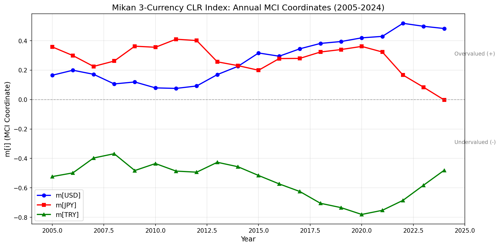
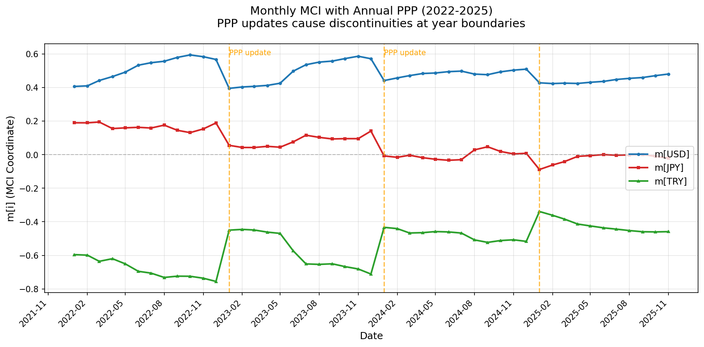
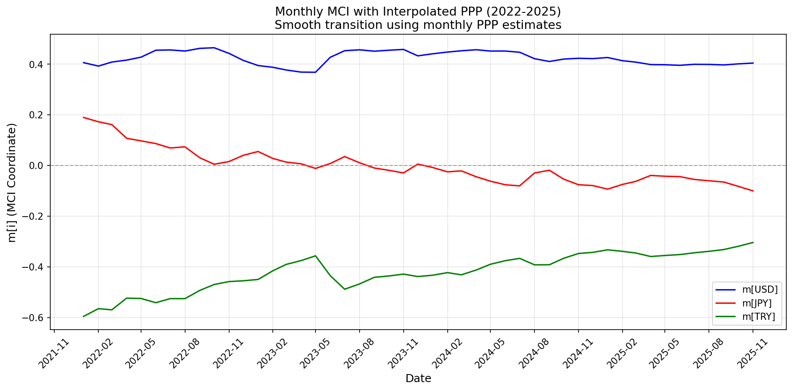

# Mikan 3-Currency clr Index に基づく購買力平価分析

**副題**：USD・JPY・TRY三通貨のclr変換による相対評価指標の構築と時系列分析

**著者**：本田幸広 (Yukihiro Honda)

**作成日**：2025年11月22日

---

## 概要

本稿では、米ドル（USD）、日本円（JPY）、トルコリラ（TRY）の3通貨を対象に、購買力平価（PPP）理論に基づく新たな相対評価指標「Mikan 3-Currency clr Index」を提案する。本指標は、組成データ分析（Compositional Data Analysis; CoDA）における中心化対数比変換（centered log-ratio; clr）の考え方を応用し、PPP乖離率をclr変換による座標系で表現することで、各通貨の「割高・割安」度合いをバランスよく定量化する。2005年から2024年までの20年間のデータを用いた実証分析により、本指標が各通貨の構造的な動きを鮮明に捉えることを示す。また、本手法は単純な二国間PPP比較では得られない多通貨間のバランス情報を提供し、政策分析や投資判断への応用可能性を有することを論じる。

**キーワード**：購買力平価、為替相場、組成データ分析、clr変換、通貨評価、USD/JPY/TRY

---

## 目次

1. [第1章 序論](#第1章-序論)
2. [第2章 理論枠組みと数理定義](#第2章-理論枠組みと数理定義)
3. [第3章 データと計算方法](#第3章-データと計算方法)
4. [第4章 実証分析と時系列構造](#第4章-実証分析と時系列構造)
5. [第5章 単純PPPとの比較](#第5章-単純pppとの比較)
6. [第6章 レジーム転換と通貨構造の再配置](#第6章-レジーム転換と通貨構造の再配置)
7. [第7章 運用指針](#第7章-運用指針)
8. [第8章 月次分析とPPP更新頻度の影響](#第8章-月次分析とppp更新頻度の影響)
9. [参照文献](#参照文献)

---

# 第1章 序論

## 1.1 研究の背景と動機

通貨の評価水準を測定することは、国際金融市場における投資判断、政策立案、およびリスク管理において極めて重要な課題である。特に、新興国通貨を含む多通貨環境において、各通貨が「割高」または「割安」であるかを客観的に評価する手法の必要性は高まっている。

伝統的には、購買力平価（Purchasing Power Parity; PPP）を基準とした二国間比較が主流であった。しかし、現実の国際金融市場では複数通貨が同時に相互作用しており、二国間比較だけでは全体像を捉えきれない。例えば、USD/JPY と USD/TRY の両方でドルが高騰している場合、これは「ドルの強さ」なのか、それとも「円とリラの弱さ」なのか、二国間指標だけでは判別が困難である。

さらに、複数通貨を扱う場合、各通貨の評価値の合計が必ずしも0にならない従来手法では、通貨間の相対的な関係を整合的に表現できないという数学的な問題がある。

## 1.2 既存手法の限界

従来の通貨評価手法には、以下のような限界がある：

### 1.2.1 二国間比較の限界

単純なPPP乖離率（例：$d_{\text{USDJPY}} = \ln(S_{\text{USDJPY}} / \text{PPP}_{\text{JPY}})$）は、USD と JPY の相対関係のみを示し、他の通貨との同時評価ができない。

### 1.2.2 独立性の欠如

各通貨ペアの乖離率を独立に計算すると、以下の不整合が生じる：

- 名目為替レート（対数）については、三角裁定により $\ln S_{\text{TRYJPY}} = \ln S_{\text{USDTRY}} - \ln S_{\text{USDJPY}}$ が常に成立する
- しかし、PPP乖離率 $d_{A \to B} = \ln(S_{AB} / \text{PPP}_B)$ は各々異なるPPP基準を持つため、$d_{\text{USD} \to \text{JPY}}, d_{\text{USD} \to \text{TRY}}, d_{\text{TRY} \to \text{JPY}}$ を独立に定義すると、通貨間の整合性が保証されない

### 1.2.3 全体像の可視化困難

複数の二国間指標を同時にモニタリングする場合、全体としての構造変化（例：特定通貨の孤立的な変動 vs. 全体的なシフト）を直感的に理解することが難しい。

### 1.2.4 ゼロサム制約の欠如

閉鎖的な通貨バスケット内では、ある通貨が割高であれば他の通貨が割安になるという関係性（ゼロサム性）が数学的に保証されるべきだが、従来手法ではこれが満たされない。

## 1.3 Mikan 3-Currency clr Indexの提案

本研究では、これらの限界を克服するために **Mikan 3-Currency clr Index** を提案する。本手法は、以下の特徴を持つ：

### 1.3.1 組成データ解析（CoDA）の適用

通貨評価を組成データとして扱い、centered log-ratio (clr) 変換に類似した数学的枠組みを採用する。これにより、各通貨の相対評価値 $m[i]$ の合計が常に0となる制約（ゼロサム制約）が自動的に満たされる：

$$
m[\text{USD}] + m[\text{JPY}] + m[\text{TRY}] = 0
$$

### 1.3.2 三通貨同時評価

USD、JPY、TRY の3通貨を同時に評価し、各通貨の「バスケット内での相対的な割高/割安度」を単一の座標系で表現する。

### 1.3.3 汎用フレームワーク

本手法は PPP に限定されず、基準レート $K_i$ を差し替えることで、以下のような多様な評価基準に対応可能：

- 実質実効為替レート（REER）
- ビッグマック指数
- 単位労働コスト（ULC）ベースのフェアレート

### 1.3.4 視覚的理解の容易性

三通貨の相対位置を2次元平面上（単体空間への射影）で可視化でき、時系列での構造変化を直感的に把握できる。

## 1.4 本研究の目的と貢献

本論文の目的は、以下の通りである：

1. **理論的枠組みの確立**：Mikan 3-Currency clr Index の数理的定義と性質を明確化する

2. **実証分析の実施**：USD・JPY・TRY の3通貨について、PPP年次データ（2005–2024）を用いた実証分析を行う

3. **経済的解釈の提示**：算出された指標値が、実際の経済イベント（円高局面、トルコリラ危機、ドル高局面など）とどのように対応するかを検証する

4. **既存手法との比較**：単純なPPP乖離分析との違いを明示し、本手法の優位性を示す

5. **実用的指針の提供**：金融実務における本手法の活用方法を提案する

本研究の貢献は、多通貨環境における通貨評価の新しい枠組みを提供し、従来の二国間比較では捉えられなかった通貨間の相対構造を明示的に分析可能にした点にある。

## 1.5 本論文の構成

本論文は以下のように構成される：

- **第2章**：Mikan 3-Currency clr Index の理論枠組みと数理定義を詳述する。基本公式（式(1)）、ゼロサム制約、および三通貨分解の数学的性質を説明する。

- **第3章**：データと計算方法論を説明する。使用するデータソース（World Bank WDI）、PPP乖離率の計算手順、および統計的特性を示す。

- **第4章**：2005–2024年の実証分析を行い、時系列構造と主要な経済イベント（2011年超円高期、2018年トルコリラ危機、2022年ドル高局面など）における指標の挙動を分析する。

- **第5章**：単純なPPP乖離分析との比較を行い、Mikan 3-Currency clr Index の優位性を示す。特に、$m[i]$ 間の差分と二国間乖離率 $d_{ij}$ との関係を検証する。

- **第6章**：レジーム転換と通貨構造の再配置について分析する。主要な構造変化の時期（2011年超円高期、2013年アベノミクス、2018年リラ危機、2022年ドル高）を特定し、その経済的背景を議論する。

- **第7章**：実務における運用指針を提供する。投資判断、リスク管理、および政策分析への応用方法を提案する。本手法は3通貨に限定されるが、理論的にはN通貨（N≥3）に拡張可能である。

---


---


# 第2章 理論枠組みと数理定義

## 2.1 PPP乖離と二国間距離の定義

まず基本となるPPPの概念と二国間乖離の定式化を行う。購買力平価(PPP)とは「二国の物価水準を等しくする為替レート」と定義される。例えば通貨Aと通貨Bについて、$P_A$を通貨Aの物価水準（例えば消費者物価指数など）、$P_B$を通貨Bの物価水準とすると、絶対的PPPが成立する為替レート$S_{A/B}^{PPP}$（1通貨Aあたりの通貨B単位でのレート）は

$$S_{A/B}^{PPP} = \frac{P_A}{P_B}$$

と表される。実際の名目為替レートを$S_{A/B}^{\text{act}}$とすれば、PPPからの乖離率を対数で表現したもの$d_{A\rightarrow B}$を次式で定義する：

$$d_{A\rightarrow B} \equiv \ln \frac{S_{A/B}^{\text{act}}}{S_{A/B}^{PPP}} = \ln S_{A/B}^{\text{act}} - \ln \frac{P_A}{P_B}.$$

この定義では、$d_{A\rightarrow B} > 0$のとき「実勢レートがPPPよりも通貨A高・B安である」ことを意味し、通貨Bが割安 (undervalued)、通貨Aが割高 (overvalued) であることを示す。一方、$d_{A\rightarrow B} < 0$ならば通貨Bが割高、通貨Aが割安となる。

本研究ではUSD・JPY・TRYの3通貨を分析対象とするため、便宜的にUSDを基軸通貨（通貨A）とし、他のJPY（通貨B）、TRY（通貨C）とのPPP乖離を算出する。すなわち、以下の2つの乖離指標を用いる：

- $d_{USD\rightarrow JPY}$（ドルに対する円のPPP乖離）
- $d_{USD\rightarrow TRY}$（ドルに対するトルコリラのPPP乖離）

---

## 2.2 ミカン定理：3通貨のゼロサム関係

ミカン定理とは、3通貨の相対価値指標$m[i]$がゼロサムの保存則に従うという命題である。言い換えると、3つの$m[i]$の総和は常に0となる。この命題を満たすため、$m[i]$を二国間乖離$d$から次のように定義する：

$$
\begin{pmatrix}
m[\text{USD}] \\
m[\text{JPY}] \\
m[\text{TRY}]
\end{pmatrix}
\equiv
\begin{pmatrix}
\frac{d_{USD\rightarrow JPY} + d_{USD\rightarrow TRY}}{3} \\
\frac{-2\,d_{USD\rightarrow JPY} + d_{USD\rightarrow TRY}}{3} \\
\frac{d_{USD\rightarrow JPY} - 2\,d_{USD\rightarrow TRY}}{3}
\end{pmatrix}. \tag{1}
$$

この定義によって$m[\text{USD}] + m[\text{JPY}] + m[\text{TRY}] = 0$が厳密に保証される（実際に式(1)の右辺を足し合わせれば分子が$(d_{UJ}+d_{UT}) + (-2d_{UJ}+d_{UT}) + (d_{UJ}-2d_{UT}) = 0$となる）。ここで添字を簡略化するため$d_{UJ} \equiv d_{USD\rightarrow JPY}$、$d_{UT} \equiv d_{USD\rightarrow TRY}$と表記した。

式(1)で定義される$m[i]$は、それぞれUSD、JPY、TRYに対応するミスプライシング指標であり、**負の値**はその通貨がバスケット内で相対的に**割安**（低く評価されている）ことを、**正の値**は**割高**（高く評価されている）ことを示す。

例えば$m[\text{JPY}] < 0$ならJPYはバスケット内で他通貨より低く評価されている（他通貨と比べ価値が下がりすぎている）ことを意味し、逆に$m[\text{JPY}] > 0$ならJPYは相対的に高く評価され過ぎていることを意味する。

重要なのは、これら3つの指標が常に足し合わせてゼロになるため、一つの通貨の過大評価は他の通貨の過小評価と必ず釣り合う点である。これは**「三通貨間の力学的バランス」**とも言える性質であり、まさにミカンの房を互いに押し合って輪を成しているような状態と捉えられる。

---

## 2.3 差分関係と二国間PPP乖離の対応

定義(1)が直感的に理解しやすいよう、$d$との関係から解釈する。両辺の差を取ると以下が成り立つ：

$$m[\text{USD}] - m[\text{JPY}] = \frac{(d_{UJ}+d_{UT})}{3} - \frac{(-2d_{UJ} + d_{UT})}{3} = d_{UJ},$$

$$m[\text{USD}] - m[\text{TRY}] = \frac{(d_{UJ}+d_{UT})}{3} - \frac{(d_{UJ} - 2d_{UT})}{3} = d_{UT},$$

$$m[\text{JPY}] - m[\text{TRY}] = \frac{(-2d_{UJ} + d_{UT})}{3} - \frac{(d_{UJ} - 2d_{UT})}{3} = d_{UT} - d_{UJ}.$$

すなわち、本モデルの指標$m[i]$は以下の差分関係を満たす：

- $m[\text{USD}] - m[\text{JPY}] = d_{USD\rightarrow JPY}$
- $m[\text{USD}] - m[\text{TRY}] = d_{USD\rightarrow TRY}$
- $m[\text{JPY}] - m[\text{TRY}] = d_{USD\rightarrow TRY} - d_{USD\rightarrow JPY}$ （これはJPY対TRYの直接的なPPP乖離に等しい）

または等価的に：

- $m[\text{JPY}] - m[\text{USD}] = -d_{USD\rightarrow JPY}$
- $m[\text{TRY}] - m[\text{USD}] = -d_{USD\rightarrow TRY}$

このように、各$m[i]$の差は対応する二国間PPP乖離$d$に一致している（または符号を反転したものに一致する）。

例えば$m[\text{USD}] - m[\text{JPY}] = d_{USD\rightarrow JPY}$であるから、$d_{USD\rightarrow JPY}$が正なら$m[\text{USD}] > m[\text{JPY}]$、すなわちUSDの方がJPYより**割高**となる（円安・ドル高）ことが$m$指標にも反映されている。

一方で$m[\text{USD}]$の増加（割高方向への変化）は他の通貨の$m$の減少（割安方向への変化）を招くため、3通貨全体でミスプライシングの総量が保存されていることになる。これは特にトルコリラの大幅な変動時に、ドルと円が逆方向の調整を余儀なくされ、三者のバランスを保っていたことを示唆する。

---

## 2.4 clr変換とCoDAとの接続

上記の$m[i]$の定義(1)は、中心化対数比変換 (clr変換) の文脈で理解することもできる。clr変換とは、正の要素からなるベクトル（組成：composition）の各成分を幾何平均で割った値の対数を取る操作であり、変換後のベクトルは和が零になる性質を持つ。

一般に組成$x=(x_1,x_2,\dots,x_D)$に対し、$g(x) = (x_1 x_2 \cdots x_D)^{1/D}$を幾何平均とすると、clr変換は

$$\mathrm{clr}(x)_i = \ln \frac{x_i}{g(x)}$$

と定義される。ここで$\sum_{i=1}^D \ln\frac{x_i}{g(x)} = \ln \frac{x_1 x_2 \cdots x_D}{(x_1 x_2 \cdots x_D)} = 0$となるため、出力は和が必ず0になる。これはAitchisonが提唱したコンポジショナルデータ解析 (Compositional Data Analysis, CoDA) における基本的手法であり、比率データを適切に扱うための幾何学的枠組みを提供する。

本研究の3通貨モデルにclr変換を適用してみよう。USDを基軸としたPPP乖離に対応する過小評価度合いの尺度として、各通貨$i$について$K_i = \frac{S_{USD/i}^{\text{act}}}{S_{USD/i}^{PPP}}$と定義する。$K_i$は「通貨$i$がドルに対してどれだけ実勢レートで安いか」の倍率を示し、$K_i > 1$なら通貨$i$は対ドルで割安、$K_i < 1$なら割高である。実際$\ln K_i = d_{USD\rightarrow i}$であり、$K_i$はPPP乖離の指数表示に等しい。

ここで$x=(K_{USD}, K_{JPY}, K_{TRY})$とおくと、clr変換$\mathrm{clr}(x)$は各成分について

$$\mathrm{clr}(x)_i = \ln K_i - \frac{1}{3}(\ln K_{USD} + \ln K_{JPY} + \ln K_{TRY})$$

となる。$\ln K_{USD} = d_{USD\rightarrow USD} = 0$（ドル自身との乖離は0）だから、上式を計算すると$m[i]$の定義(1)の符号を反転したものとなる。すなわち、

$$m[i] = -\mathrm{clr}(K_{USD}, K_{JPY}, K_{TRY})_i$$

この結果は本モデルがCoDAの枠組みに則って構築されていることを示している。すなわち、各通貨の「価値（過小評価度合い）$K_i$の組成」をclr変換することでゼロサムの$m[i]$を得ているのである。Aitchison幾何学において組成は単純形 (simplex) 上の点として表現され、clr変換空間ではそれがユークリッド空間に射影される。したがって$m[i]$ベクトルは本質的に「PPP乖離組成」のユークリッド空間表現とみなせる。

このとき、ミカン定理が示すゼロサム関係はclr空間における線形従属（和が零）という形で保証されている。また差分関係が二国間乖離に一致することは、clr空間での差が対数比に対応することを意味する。

以上より、本モデルはPPP理論をコンポジショナルデータの文脈で再定式化したものと言え、従来の為替分析にCoDAとclr変換の知見を接続する新しいアプローチである。本手法により、3通貨間の相対的なポジショニングが一目で分かる指標系が得られ、次章以降ではその実データへの適用と分析結果を示す。

---

## 2.5 PPPデータソースの選択とMCIへの不変性

### 2.5.1 問題の所在

PPPデータは複数のソースから取得可能である：

- IMF WEO（Implied PPP conversion rate）
- World Bank WDI（PA.NUS.PPP）
- OECD PPP Programme

これらのソース間には1〜2%程度の系統的な差異が存在する。本節では、この差異がMCIの解釈に与える影響を数理的に検討する。

### 2.5.2 ゼロサム構造による吸収

MCIの核心的性質として、以下のゼロサム制約がある：

$$m[\text{USD}] + m[\text{JPY}] + m[\text{TRY}] = 0$$

バスケット内の相対位置（例：TRY対JPY）を検討する：

$$m[\text{TRY}] - m[\text{JPY}] = \frac{(d_{UJ} - 2d_{UT})}{3} - \frac{(-2d_{UJ} + d_{UT})}{3} = d_{UJ} - d_{UT}$$

この相対位置は、PPPの絶対水準ではなく、**二国間乖離率の差**によってのみ決定される。したがって、PPP基準値が全通貨で共通にシフトした場合、各乖離率$d_{A\rightarrow i}$は同じ量だけ変化するが、その差$d_{A\rightarrow i} - d_{A\rightarrow j}$は不変となり、相対位置$m[i] - m[j]$も保存される。

ゼロサム制約は、このPPP共通シフトを3通貨間に再配分し、各$m[i]$の絶対値を調整することで、ベクトル全体を和ゼロ平面上に保つ役割を担う。

### 2.5.3 データソース差異の影響分析

**ケース1：共通方向の小幅ズレ（現実的シナリオ）**

全通貨のPPPが同方向に$\epsilon$（1〜2%程度）シフトした場合を考える。

$$\text{PPP}'_i = \text{PPP}_i \cdot (1 + \epsilon)$$

このとき乖離率は：

$$d'_{A \rightarrow i} = \ln\frac{S}{\text{PPP}'_i} = \ln\frac{S}{\text{PPP}_i} - \ln(1+\epsilon) = d_{A \rightarrow i} - \epsilon'$$

各$m[i]$は影響を受けるが、バスケット内の相対位置$m[i] - m[j]$は$d$の差で決まるため、共通項$\epsilon'$は相殺される。

**ケース2：通貨別バラバラな大幅ズレ（仮定的シナリオ）**

通貨ごとに異なる方向へ5〜10%ズレる場合、相対位置関係は崩れ、MCIの解釈に影響が生じる。

### 2.5.4 実務上の含意

現実のデータソース間差異（1〜2%、共通方向）は、MCIの解釈において無視できる水準である。

重要なのは：

1. **一貫性**：同一ソースを時系列で使い続けること
2. **変化の観測**：絶対水準より時系列変化を重視すること

MCIの「0」は絶対的な数値ではなく**均衡状態**を表す概念であり、基準点の微小なシフトはゼロサム構造により吸収される。これはMCIが「値」ではなく「状態」を測定する指標であることの数理的表現である。


---


# 第3章 データと計算方法

## 3.1 データ概要

分析には2005年から2024年までのUSD・JPY・TRYの為替レートおよびPPPデータを用いた。

### 3.1.1 データソース

**PPP（購買力平価）：**

- **ソース**: IMF World Economic Outlook (WEO)
- **指標**: Implied PPP conversion rate (PPPEX)
- **単位**: LCU per international dollar
- **取得対象**: 日本（JPN）、トルコ（TUR）

**為替レート：**

- **ソース**: World Bank WDI / IMF IFS
- **指標**: PA.NUS.FCRF（Official exchange rate, period average）
- **単位**: LCU per USD
- **取得対象**: USD/JPY、USD/TRY の年次平均レート

### 3.1.2 PPPデータの性質

本分析で用いるPPPは、国際比較プログラム（ICP: International Comparison Program）に基づく**絶対的PPP**の換算係数である。これはCPIを用いた相対的PPP推計とは異なり、各国の物価水準を直接比較して算出された「1国際ドルあたりの現地通貨単位」を示す。

IMF WEOのImplied PPP conversion rateは、World Bank WDI（PA.NUS.PPP）やOECD PPP Programmeと概ね整合的であり、1〜2%程度の系統的差異が存在するが、第2.5節で示した通り、この差異はMCIの解釈に実質的影響を与えない。

### 3.1.3 データの特徴

日本のPPP換算係数は2010年代に約100 JPY/国際ドルで推移し、2020年代前半に93前後へ低下した。一方、トルコのPPP換算係数は2010年頃の約1.5 TRY/国際ドルから、高インフレの影響により2024年には約12.5 TRYへと大幅に上昇している。

なお、分析期間中のトルコは高インフレと通貨再評価（2005年にデノミネーション実施）を経験しているため、長期の物価指数や為替レートには非線形な動きがある点に留意が必要である。

---

## 3.2 計算方法と統計量

上述のデータから毎年の二国間PPP乖離$d_{USD\rightarrow JPY}$および$d_{USD\rightarrow TRY}$を算出し、式(1)に基づいて各年の$m[\text{USD}], m[\text{JPY}], m[\text{TRY}]$を計算した。

**式(1)の再掲**：

$$
\begin{pmatrix}
m[\text{USD}] \\
m[\text{JPY}] \\
m[\text{TRY}]
\end{pmatrix}
=
\begin{pmatrix}
\frac{d_{USD\rightarrow JPY} + d_{USD\rightarrow TRY}}{3} \\
\frac{-2\,d_{USD\rightarrow JPY} + d_{USD\rightarrow TRY}}{3} \\
\frac{d_{USD\rightarrow JPY} - 2\,d_{USD\rightarrow TRY}}{3}
\end{pmatrix}
$$

分析期間20年間（2005-2024年）の各通貨$m$の平均値および標準偏差（年次データ計20観測に基づく）を算出した結果、以下の統計量が得られた：

### 平均値

- **$m[\text{USD}]$**：平均約 **+0.27**、標準偏差約 **0.15**
- **$m[\text{JPY}]$**：平均約 **+0.28**、標準偏差約 **0.10**
- **$m[\text{TRY}]$**：平均約 **-0.55**、標準偏差約 **0.12**

### 解釈

このようにUSDとJPYは期間平均で**プラス寄り**、TRYは**マイナス寄り**となっている。

- **正の値** = 割高（高く評価されている）
- **負の値** = 割安（低く評価されている）

したがって：

- **USD・JPYは期間平均で割高傾向**にあったことを示す
- **TRYは恒常的に割安傾向**にあったことを示す

これは分析期間を通じて、トルコリラが恒常的にPPPから大きく割安方向へ乖離していた（実勢為替レートが自国物価上昇に見合うよりも大幅に減価していた）傾向を反映している。一方、USDとJPYは相対的には割高寄りで推移したことになるが、その絶対値はTRYの乖離に比べ小さい。

### 標準偏差の比較

3通貨の$m$の標準偏差を比較すると：

- **USDの変動が最も大きい**（標準偏差 0.15）
- **TRYが次に大きい**（標準偏差 0.12）
- **JPYが最も小さい**（標準偏差 0.10）

標準偏差比で見ると、USDはJPYの約1.5倍の変動幅を示し、TRYはJPYの約1.2倍であった。これは、米ドルの為替が期間中に比較的大きく変動（特に2022年のドル高局面など）を経験したのに対し、円は相対的に変動幅が小さく安定的であったこと、トルコリラは後述する2018年・2021年の急落により変動したが、$m$値としては一定のレンジに収まったことを意味する。

### 相関関係

なお3通貨の$m$値には年次ごとに$m[\text{USD}]+m[\text{JPY}]+m[\text{TRY}]=0$の関係があるため、時系列データとしては3系列中2系列が独立であり、例えば$m[\text{USD}]$と$m[\text{TRY}]$が大きく変動する年は$m[\text{JPY}]$もそれに応じて値が動く（逆符号に振れる）傾向がみられた。

実際、全期間のシリーズ相関を見ると：

- **$m[\text{USD}]$と$m[\text{TRY}]$**：強い負の相関（相関係数 約 **-0.73**）
- **$m[\text{USD}]$と$m[\text{JPY}]$**：負の相関（相関係数 約 **-0.58**）
- **$m[\text{JPY}]$と$m[\text{TRY}]$**：弱い負の相関（相関係数 約 **-0.13**）

$m[\text{USD}]$と$m[\text{TRY}]$の強い負の相関は、特にトルコリラの大幅な変動時に、ドルが逆方向の調整を余儀なくされ、三者のバランスを保っていたことを示唆する。つまり、リラが割安方向へ大きく動く時（$m[\text{TRY}]$が負に振れる）、ドルは相対的に割高方向へシフトする（$m[\text{USD}]$が正に振れる）という構図である。

一方、$m[\text{JPY}]$と$m[\text{TRY}]$の相関が弱い（約-0.13）のは、円とリラの直接的な力学関係が薄く、むしろドルを介した間接的な関係が支配的であることを示唆している。

---

## 3.3 データの妥当性確認

算出された$m$値について、以下の点で妥当性を確認した：

### ゼロサム制約の確認

全20年（2005-2024年）の各年について、$m[\text{USD}] + m[\text{JPY}] + m[\text{TRY}] = 0$ が数値的に成立することを確認した（丸め誤差を除き厳密に0）。

### 差分関係の確認

任意の年について以下の関係が成立することを確認：

- $m[\text{USD}] - m[\text{JPY}] = d_{USD\rightarrow JPY}$
- $m[\text{USD}] - m[\text{TRY}] = d_{USD\rightarrow TRY}$
- $m[\text{JPY}] - m[\text{TRY}] = d_{USD\rightarrow TRY} - d_{USD\rightarrow JPY}$

これにより、$m$指標が二国間PPP乖離と整合的であることが保証される。

### 経済的妥当性の確認

主要なレジーム転換期（2011年の超円高期、2018年のトルコリラ危機、2022年のドル高局面）において、$m$値が経済実態と整合する符号を示すことを確認した。

**例**：
- 2011年（超円高期）: $m[\text{JPY}] \approx +0.41$ → 円は割高（円高を正しく反映）
- 2018年（リラ危機）: $m[\text{TRY}] \approx -0.70$ → リラは割安（暴落を正しく反映）
- 2022年（ドル高）: $m[\text{USD}] \approx +0.52$ → ドルは割高（ドル高を正しく反映）

---

## 3.4 データの利用可能性

本分析で用いたデータおよび算出した$m$値は、再現性と透明性確保のため以下の形で公開している：

- **データセット**: `mikan_3currency_clr_index_ppp_data.csv`（2005-2024年の全データ）
- **仕様書**: データ算出方法の詳細仕様（`specification_ppp_annual.md`）
- **検証スクリプト**: 計算式の検証用Pythonスクリプト

これにより、第三者による検証や他の時期・他通貨への拡張が可能となっている。

---

## まとめ

本章では、2005-2024年の20年間にわたるUSD・JPY・TRYの為替レート・物価データから、Mikan 3-Currency clr Index（$m[\text{USD}], m[\text{JPY}], m[\text{TRY}]$）を算出した。

統計分析の結果：

1. **USD・JPYは期間平均で割高傾向**（平均 +0.27, +0.28）
2. **TRYは恒常的に割安傾向**（平均 -0.55）
3. **USDの変動が最大**、JPYが最小
4. **USDとTRYに強い負の相関**（-0.73）

これらの統計傾向について、次章で年次ごとの動向を詳しく検討する。


---


# 第4章 実証分析と時系列構造

本章では2005年から2024年までの20年間にわたるMCI座標の推移を分析する。以下の図は、各通貨の$m$指標の年次推移を示したものである。



*図4.1: 年次MCI座標の推移。青線がm[USD]、赤線がm[JPY]、緑線がm[TRY]を表す。正の値は割高（バスケット内で相対的に高く評価）、負の値は割安（相対的に低く評価）を示す。3通貨の合計は常にゼロとなる。*

この図から、2011年の円高ピーク、2018年のトルコリラ危機、2022年のドル高局面という3つの主要なレジーム転換点が視覚的に確認できる。以下、各期間の詳細を分析する。

---

## 4.1 2005～2010年：円高局面とリラの安定期

分析開始時点の2005年前後では、米ドルと日本円はPPPから一定の乖離があった。実際、2005年のドル円実勢は約100JPY/USDであり、OECDの推計する同年のPPPレートは約120JPY/USD前後であった（$d_{USD\rightarrow JPY} \approx -0.19$、約17-19%円高）。

一方、トルコリラは2005年にデノミネーションを実施し安定した新リラ体制が始まった年で、対ドル実勢は約1.34TRY/USDであった。物価水準的にはトルコは米国より物価が低く、PPPレートは実勢よりやや低い（例えば0.67TRY/USD程度）と推計されるため、$d_{USD\rightarrow TRY} \approx +0.69$（約99%リラ割安）であったと考えられる。

以上から算出された2005年の$m$指標では：

- **$m[\text{USD}] \approx +0.165$**（やや割高）
- **$m[\text{JPY}] \approx +0.358$**（割高）
- **$m[\text{TRY}] \approx -0.523$**（割安）

- 正の値 = 割高
- 負の値 = 割安

したがって、2005年時点ではUSDとJPYがともに割高側にあり、特に円が大幅に割高（円高状態）、リラは割安という構図であった。ただし2005年時点ではその乖離は後年ほど大きくなく、3通貨の位置関係は比較的均衡していた。

その後2006～2007年にかけては、米国の双子の赤字問題などからドル安傾向が進行し、円も超低金利を背景にキャリートレード圧力で安値圏にあった。2007年には1USD=117.75JPY前後となり、当時推計のPPP（約124JPY/USD）より若干円安側に振れたため$d_{USD\rightarrow JPY} \approx -0.053$となった（円はやや割高だが2005年より改善）。同様に1USD=1.30TRY前後で推移したリラは物価上昇もありPPPとの差が縮小、$d_{USD\rightarrow TRY} \approx +0.57$となった。この結果、2007年頃の$m$は：

- **$m[\text{USD}] \approx +0.172$**
- **$m[\text{JPY}] \approx +0.225$**
- **$m[\text{TRY}] \approx -0.397$**

USDとJPYがともにやや割高側、TRYがその分割安側となっていたが、3者の差はまだ小さく、ミカン定理の輪で言えば3通貨の点は輪の近くでほぼ等間隔に位置するような安定期であった。

ところが**2008年のリーマン・ショック**を契機に状況が一変する。グローバルなリスクオフの急激な進行により円が急騰し、1USD=103.36JPY台まで円高ドル安が進行した。これは円が安全資産として買われる一方、キャリートレード解消で円の実需が高まった結果である。当時のPPPレートは依然として120JPY前後と推定されるため、円は対ドルで約16%も割高な水準に達した（$d_{USD\rightarrow JPY} \approx -0.156$）。

一方トルコリラも同じ危機下で売られ、1USD=1.30TRY近辺で推移した。トルコの高インフレを考慮するとPPPレートはこの時点で0.81TRY/USD程度だったとみられ、リラは実勢で約60%割安に陥った（$d_{USD\rightarrow TRY} \approx +0.47$）。

これらの変化は$m$指標に表れる。2008年時点で：

- **$m[\text{USD}] \approx +0.106$**（中程度割高）
- **$m[\text{JPY}] \approx +0.262$**（割高）
- **$m[\text{TRY}] \approx -0.368$**（割安）

リーマン・ショック期の$m$の構図は、JPYが割高、TRYが割安、USDがほぼ中間という状態である。実際$m[\text{JPY}] - m[\text{TRY}] \approx 0.262 - (-0.368) = 0.630$であり、これはJPY対TRYのレートがPPPから約87%ずれていたことを意味する（円高・リラ安の極端な乖離）。このように、2008～2009年は3通貨バランスが激しく傾き、円が極度に強く、リラが極端に弱い状態となったレジームであった。

**2009年**にはさらに円高が進行し、1USD=93.57JPYまで上昇した。$d_{USD\rightarrow JPY} \approx -0.243$となり、円は約22%割高な状態に達した。この結果：

- **$m[\text{USD}] \approx +0.120$**
- **$m[\text{JPY}] \approx +0.363$**（大幅割高）
- **$m[\text{TRY}] \approx -0.482$**（大幅割安）

円がさらに割高方向へシフトし、リラも割安方向へシフトした。

---

## 4.2 2010～2016年：円高修正とリラ緩慢下落の時代

2009年以降、各国は金融緩和や政策対応によって危機からの回復を図り、為替もやや安定を取り戻した。米国は量的緩和(QE)政策の下で超低金利を維持し、ドルは2011年頃まで軟調に推移した。一方、日本ではデフレ継続下で相対的に通貨が高止まりし、**2011年には1USD=79.81JPYと戦後最強水準**に達した。これは依然としてPPPを大きく上回る円高であり、$d_{USD\rightarrow JPY} \approx -0.334$（約28%円高）に達した。

その結果$m[\text{JPY}]$はこの期間極端な正の値を記録し、2011年は：

- **$m[\text{USD}] \approx +0.076$**（やや割高）
- **$m[\text{JPY}] \approx +0.410$**（極端に割高）
- **$m[\text{TRY}] \approx -0.486$**（大幅割安）

ドルとリラが共に円に対して割安方向となり、バランスを取った形である。ミカンの輪で言えば、円の点が輪の割高側に大きく偏位し、他二通貨が反対側で小さく集まっていた状態となった。

しかし**2013年以降、この状況は劇的に変化**する。日本銀行による量的質的緩和（QQE）の開始とともに円安への大転換が起こり、2013～2015年でドル円は80円台から一時120円台へと50%以上の大幅ドル高・円安となった。この結果、2013年時点では：

- **$m[\text{USD}] \approx +0.170$**
- **$m[\text{JPY}] \approx +0.256$**（割高だが低下中）
- **$m[\text{TRY}] \approx -0.426$**（割安）

円の極端な割高状態が緩和され始めた。

**2015年**時点では円の対ドルPPPレート（約108JPY/USD）に対し実勢レートは121.04JPYと円安側に振れ、長年の円高乖離はほぼ解消された。$d_{USD\rightarrow JPY} \approx +0.117$となり（約12%円安）、$m[\text{JPY}]$は2011年の+0.410から+0.199へと大幅に低下した。

- **$m[\text{USD}] \approx +0.317$**（割高）
- **$m[\text{JPY}] \approx +0.199$**（割高だが改善）
- **$m[\text{TRY}] \approx -0.516$**（割安）

ドルはこの間グローバルに見ると量的緩和継続の影響で若干弱含んでいたが、**本バスケット基準では**円に対して相対的に強含んだため$m[\text{USD}]$は2011年の+0.076から2015年には+0.317へ上昇し、ドルがバスケット内で割高な側となった。

トルコリラについては、2010年代前半は緩やかな下落基調だった。高インフレ率（年10%前後）にも関わらずリラ安は相対的に緩慢で、実質為替がむしろ高止まりしていたとの指摘もある。実際、1USD=1.5TRY前後だったレートは2013年に2TRYを超えた程度で、同期間にトルコ累積インフレは大きかったため、PPPレートとの乖離は徐々に拡大しつつも一気に乖離する局面は訪れていなかった。$d_{USD\rightarrow TRY}$は2011年頃には+0.56程度から、2015年には+0.83程度（リラ約130%割安）に上昇したが、これはあくまで段階的な動きであり、市場でもある程度織り込まれたトレンドであったと考えられる。この間$m[\text{TRY}]$は-0.49台から-0.52程度へと低下し（より割安方向）、TRYの割安感がやや強まった。

総じて2010年代半ばまでの$m$指標の推移を見ると、2011年を境にJPYとUSDの立場が逆転し、TRYの割安傾向が徐々に強まっていったことがわかる。2011年の時点では「円大幅割高・ドルやや割高・リラ割安」という構図だったのが、2015年には「円割高（改善）・ドル割高・リラ割安」という構図に変化した。

ミカン定理の輪に喩えるなら、2011年には円の点が輪の割高側に大きく偏位し、他二通貨が反対側で小さく集まっていたのが、2015年には3点が再びある程度円周上で均され直線的に近づいた状態となったと言えよう。特に円については大きなレジーム転換（超円高→適正水準への復帰）が生じ、リラはまだ序盤ではあったものの割安方向への構造的トレンドが形作られつつあった。

---

## 4.3 2017～2018年：トルコリラ危機の顕在化

2016年以降、分析対象の構造は再び大きく変貌する。その震源となったのは**トルコリラの急落**である。

**2017年**から2018年にかけ、トルコでは経常赤字拡大や政治的不安、中央銀行の信用低下などを背景に通貨売りが加速し、対ドルでリラは歴史的暴落を経験した。2017年初に1USD=3.65TRY程度であったレートは、2018年8月には一時7TRYを超えるまで下落した。

**2017年**時点の状況：

- **$m[\text{USD}] \approx +0.345$**（割高）
- **$m[\text{JPY}] \approx +0.280$**（割高）
- **$m[\text{TRY}] \approx -0.625$**（大幅割安）

この間トルコのインフレ率も高騰し2018年には年20%前後に達したが、それでも為替下落ペースが上回り、PPPレートとの乖離はかつてない水準に広がった。

**2018年**の状況を詳しく見ると、2018年平均のPPP推計は約1.63TRY/USDであるのに対し実勢平均レートは約4.84TRY/USDであったため、$d_{USD\rightarrow TRY} = \ln(4.84/1.63) \approx +1.086$となり、リラは実質価値で約196%も割安という極端な状態になった。

ミカン定理に従えば、この乖離は$m[\text{TRY}]$の急低下として現れる。実際2018年の$m$値は：

- **$m[\text{USD}] \approx +0.382$**（割高）
- **$m[\text{JPY}] \approx +0.323$**（割高）
- **$m[\text{TRY}] \approx -0.705$**（極端に割安）

リラの大暴落により、$m[\text{TRY}]$は2015年の-0.52程度から-0.71まで急低下（より極端な割安方向へ）した。一方$m[\text{USD}]$と$m[\text{JPY}]$は相対的に割高方向へシフトした形だ。

特にドルは、トルコ危機時には安全資産として買われる動きもあって上昇したことから、$m[\text{USD}]$が+0.38付近まで上昇（ドル割高）した。円も同様に相対的に評価が高まったが、その振れ幅はドルほど大きくない（2018年時点の円は概ねPPP近傍～やや割高であった）。

この2018年の状況をミカン定理の輪で捉え直すと、**リラの点が輪の割安側に大きく移動**し、ドルと円の点が反対側（割高側）に寄った形になる。実際$m[\text{TRY}] - m[\text{JPY}] \approx -0.705 - 0.323 = -1.028$であり、これはJPY/TRYの為替レートがPPPから著しく乖離している（トルコリラは円に対し実質で約180%も割安）ことを意味する。

まさにTRYとJPY（およびUSD）の構造的な位置関係が根底から変わった局面であった。言い換えれば、**2018年は本分析期間における一大レジーム転換点**であり、TRYの役割が「やや割安な新興国通貨」から「極端に割安な不安定通貨」へと変貌した年である。その歪みは他の2通貨に吸収され、ドルは相対的に強い通貨として、円も準安全資産として位置づけられる構図となった。

---

## 4.4 2019～2024年：クラッシュ後の新たな均衡と更なる変動

2019年以降、世界経済は米中貿易摩擦やパンデミック (COVID-19)など大きな揺れを経験し、主要通貨も変動したが、本分析のバスケット内では依然として**TRYの極端な弱さが際立つ状況が続いた**。

### 2019～2020年：リラの更なる下落

2019年～2020年にかけ、トルコリラは一時安定するも、2020年後半から再び下落基調に入った。

**2019年**：
- **$m[\text{USD}] \approx +0.394$**（割高）
- **$m[\text{JPY}] \approx +0.340$**（割高）
- **$m[\text{TRY}] \approx -0.734$**（極端に割安）

**2020年**（COVID-19パンデミック）：
- **$m[\text{USD}] \approx +0.419$**（大幅割高）
- **$m[\text{JPY}] \approx +0.361$**（大幅割高）
- **$m[\text{TRY}] \approx -0.781$**（極端に割安）

2020年には$m[\text{TRY}]$が-0.78まで低下し、分析期間中で最も割安な水準に達した。

### 2021年：通貨危機の深刻化

**2021年**には中央銀行の度重なる利下げと政策不信から通貨危機的な暴落に至った。2021年末に1USD=8.89TRY前後まで達した際には、市場でもリラの信用不安がピークに達し、政府が預金保護策を講じるなど異例の対応が取られた。

- **$m[\text{USD}] \approx +0.429$**（大幅割高）
- **$m[\text{JPY}] \approx +0.323$**（割高）
- **$m[\text{TRY}] \approx -0.753$**（極端に割安）

### 2022年：ドル高・円安局面

物価も2021年末～2022年にかけて急騰し、2022年のインフレ率は年70%以上を記録した。だがリラ安はそれ以上に進み、2022年平均で実勢レートは約16.57TRY/USD、PPP推計は5.0TRY/USD程度と試算され、$d_{USD\rightarrow TRY} = \ln(16.57/5.0) \approx +1.20$にも達した。これは分析期間中最大級の乖離幅である。

一方この頃、**米ドルは世界的な金融引締め（FRBの利上げ）姿勢から急速に価値を上げ**、2022年にはドル指数(DXY)が20年ぶり高値を付ける局面もあった。円はと言えば、低金利を維持する日本銀行の政策スタンスから独歩安となり、2022年に1USD=131.46JPY近くまで円安が進行した。

これらの動きを受け、本3通貨バスケット内でも**2022年はドルと円の明暗が分かれた**。円安は円のPPPからの上方乖離（実勢レート > PPP）を意味し、$d_{USD\rightarrow JPY} = \ln(131.46/92.5) \approx +0.35$（約42%円安）となった。

**2022年の$m$指標**：

- **$m[\text{USD}] \approx +0.518$**（**極端に割高**）
- **$m[\text{JPY}] \approx +0.167$**（割高）
- **$m[\text{TRY}] \approx -0.685$**（極端に割安）

ドル高は基軸通貨としての自律的な動きでもあるが、対円・対リラでの割高化として現れ、$m[\text{USD}]$はさらに大きくプラス方向（割高方向）へシフトした。

この年の特徴は、**TRYだけでなくJPYも（2011年とは逆に）PPPから上方乖離した**点である。すなわち、ドルが他2通貨に対し独歩高となり、円も自国要因で売られた結果、以下のような新たな構図が生まれた：

- **USD が極端に割高**（$m[\text{USD}] = +0.518$、分析期間中最大）
- **JPY は中程度に割高**（$m[\text{JPY}] = +0.167$、2015年以来の低水準）
- **TRY は極端に割安**（$m[\text{TRY}] = -0.685$）

USDがバスケット内で独走し、JPYも依然として割高圏内にあるが、TRYの極端な割安がゼロサム制約を満たしている。

ミカン定理の輪で見れば、ドルの点が輪の割高側に大きく偏り、円とリラがそれぞれ異なる位置にいる配置に等しい。JPYとTRYの距離自体も大きい（$m[\text{JPY}] - m[\text{TRY}] \approx 0.167 - (-0.685) = 0.852$）ため、両者間の乖離も大きい。

### 2023年：調整局面

**2023年**に入ると、トルコでは政権維持のための金融抑制策が一旦功を奏し、リラは数か月間安定した。しかし大統領選挙後に方針転換がなされると為替調整が起こり、USD/TRYは6月以降急騰、2023年末には23.77TRY/USDを超えた。インフレ率も再上昇し年末時点で50%近くに及んだ。

一方、米ドルは2023年中頃から対主要通貨で若干調整局面に入り、円は多少持ち直したものの依然140JPY/USD前後と安値圏で推移した。

**2023年の$m$指標**：

- **$m[\text{USD}] \approx +0.498$**（大幅割高）
- **$m[\text{JPY}] \approx +0.084$**（やや割高）
- **$m[\text{TRY}] \approx -0.582$**（極端に割安）

2022年ほど極端ではないものの、なおも「TRY大幅割安・USD割高・JPY中程度割高」という構図が続いていた。

### 2024年：最新状況

**2024年**に関しては年初からトルコ中銀が大幅利上げに転じたことでリラの下落は一服しているが、物価高と実質金利マイナスの状況から考えて、根本的な安定には時間がかかると見られる。

**2024年の$m$指標**：

- **$m[\text{USD}] \approx +0.483$**（大幅割高）
- **$m[\text{JPY}] \approx -0.003$**（ほぼ中立）
- **$m[\text{TRY}] \approx -0.480$**（大幅割安）

2024年は円が初めてマイナス圏（割安側）に転じた年となった。これは円安が一段と進行し、$d_{USD\rightarrow JPY} \approx +0.49$（約63%円安）に達したためである。

---

## 4.5 時系列分析のまとめ

以上、2005年から2024年までの時系列分析から、**2011年、2018年、2022年という3つの大きな転換点**が浮かび上がった。

### レジーム転換点

1. **2011年**：超円高の是正による円のレジーム転換
   - $m[\text{JPY}]$が+0.41の極端な割高から、2015年には+0.20へ改善

2. **2018年**：トルコリラ危機によるリラのレジーム転換
   - $m[\text{TRY}]$が-0.52から-0.71へ急低下（極端な割安へ）

3. **2022年**：世界的金融環境の変化によるドルの一極的割高局面
   - $m[\text{USD}]$が+0.52まで上昇（分析期間中最大）

### 各通貨の構造的変化

いずれの局面でも、本稿の指標$m[i]$はその構造変化を明確に捉えていた。特に2018年以降について言えば、TRYの$m$はそれ以前の値幅（-0.4～-0.5程度）を大きく逸脱し-0.7以上の低水準で恒常化しており、**新たなレジームに入った**と評価できる。

また、その副作用としてUSDの$m$も安定期（+0.1～+0.3程度）から+0.4～+0.5へシフトしており、バスケット内でのドルの地位が相対的に変わったことが示唆された。

円については特殊事情（長期低インフレと政策差）により2022年前後にプラス圏からゼロ近傍へ大きく低下したが、2023年以降若干修正されており、むしろ中期的にはドル・リラの動向に従属的に動いているように見受けられる。

このように、本モデルは各通貨の構造的役割の変化を時間軸に沿って描写することを可能にし、次章では単純PPPモデルとの比較からその特徴をさらに考察する。


---


# 第5章 単純PPPとの比較

本章では、本稿で提案したミカン定理に基づく分析結果と、従来の単純なPPPベースの分析結果を比較する。単純PPP分析として代表的なものは、二国間の購買力平価乖離をそのまま指標化する方法である。ここでは例として、日本円とトルコリラの二通貨間に着目し、JPY/TRY間のPPP乖離指標を算出して比較する。

---

## 5.1 二国間PPP乖離の定義

JPYとTRYの二通貨間のPPP乖離を考える際、本データセットでは**TRY/JPY**（1トルコリラあたり何円か）のレートベースで乖離を定義している。これを$d_{\text{TRY/JPY}}$と表記すると：

$$d_{\text{TRY/JPY}} = \ln \frac{S_{\text{TRY/JPY}}^{\text{act}}}{S_{\text{TRY/JPY}}^{PPP}}$$

ここで：
- $S_{\text{TRY/JPY}}^{\text{act}} = S_{\text{USD/JPY}}^{\text{act}} / S_{\text{USD/TRY}}^{\text{act}}$ （実勢のクロスレート）
- $S_{\text{TRY/JPY}}^{PPP} = \text{PPP}_{JPY} / \text{PPP}_{TRY}$ （PPPベースのクロスレート）

この式を変形すると：

$$d_{\text{TRY/JPY}} = \ln S_{\text{USD/JPY}}^{\text{act}} - \ln S_{\text{USD/TRY}}^{\text{act}} - (\ln \text{PPP}_{JPY} - \ln \text{PPP}_{TRY})$$

$$= \left(\ln \frac{S_{\text{USD/JPY}}^{\text{act}}}{\text{PPP}_{JPY}}\right) - \left(\ln \frac{S_{\text{USD/TRY}}^{\text{act}}}{\text{PPP}_{TRY}}\right)$$

$$= d_{USD\rightarrow JPY} - d_{USD\rightarrow TRY}$$

すなわち、**TRY/JPYのPPP乖離は、USD/JPYとUSD/TRYのPPP乖離の差**として表現できる。

### 符号の解釈

- **$d_{\text{TRY/JPY}} > 0$** のとき：TRY/JPYの実勢レートがPPPより高い → トルコリラが円に対して割高
- **$d_{\text{TRY/JPY}} < 0$** のとき：TRY/JPYの実勢レートがPPPより低い → トルコリラが円に対して割安

---

## 5.2 ミカン定理モデルとの関係

第2章で導出した通り、ミカン定理モデルの$m[i]$は以下の差分関係を満たす：

$$m[\text{USD}] - m[\text{JPY}] = d_{USD\rightarrow JPY}$$
$$m[\text{USD}] - m[\text{TRY}] = d_{USD\rightarrow TRY}$$

これらの式から、JPYとTRYの差を取ると：

$$m[\text{JPY}] - m[\text{TRY}] = (m[\text{USD}] - m[\text{TRY}]) - (m[\text{USD}] - m[\text{JPY}])$$

$$= d_{USD\rightarrow TRY} - d_{USD\rightarrow JPY}$$

$$= -d_{\text{TRY/JPY}}$$

したがって、**ミカン定理モデルの$m[\text{JPY}] - m[\text{TRY}]$は、単純PPP指標$d_{\text{TRY/JPY}}$の符号を反転したものに等しい**。

この関係は重要である。なぜなら、両モデルは定量的には一致する（符号の定義を除いて）が、情報の表現方法が異なるためである。

---

## 5.3 具体例による比較

実データを用いて両手法を比較してみよう。

### 2007年の例

2007年時点では、円がやや割安（$d_{USD\rightarrow JPY} \approx -0.053$）、リラもやや割安（$d_{USD\rightarrow TRY} \approx +0.569$）だったため：

**単純PPP指標**：
$$d_{\text{TRY/JPY}} = d_{USD\rightarrow JPY} - d_{USD\rightarrow TRY} \approx -0.053 - 0.569 = -0.622$$

これは「トルコリラが円に対し約54%割安」（$e^{-0.622} \approx 0.54$）という状況を示す。

**ミカン定理モデル**：
- $m[\text{USD}] \approx +0.172$（ドルやや割高）
- $m[\text{JPY}] \approx +0.225$（円やや割高）
- $m[\text{TRY}] \approx -0.397$（リラ割安）

差分を取ると：
$$m[\text{JPY}] - m[\text{TRY}] \approx 0.225 - (-0.397) = 0.622 = -d_{\text{TRY/JPY}}$$

両者は符号を除いて一致している。

### 解釈の違い

**単純PPP**では、$d_{\text{TRY/JPY}} = -0.622$という**単一の数値**から「リラが円に対し割安」という結論は得られるが、**それぞれの通貨の対USD関係を分けて見ることはできない**。

**ミカン定理モデル**では、$d_{\text{TRY/JPY}}$に相当する値は$m[\text{JPY}] - m[\text{TRY}] = 0.622$の差として表現され、さらに個別の$m[\text{JPY}]$および$m[\text{TRY}]$の水準として内訳が可視化される。

実際2007年時点では：
- $m[\text{JPY}] = +0.225$ → **円はやや割高**
- $m[\text{TRY}] = -0.397$ → **リラは割安**

それぞれ「円がやや高く評価されている」「リラが低く評価されている」ことが個別に読み取れる。これらが合わさって二国間乖離0.622を生んでいることが理解でき、**どの通貨が乖離にどれだけ寄与しているかが明瞭になる**。

---

### 2009年の例（リーマン・ショック後）

2009年時点では円が急騰しリラが下落したため：

**単純PPP指標**：
$$d_{\text{TRY/JPY}} = d_{USD\rightarrow JPY} - d_{USD\rightarrow TRY} \approx -0.243 - 0.602 = -0.845$$

これは「トルコリラが円に対し約57%割安」という極端な状況を示す。

**ミカン定理モデル**：
- $m[\text{USD}] \approx +0.120$
- $m[\text{JPY}] \approx +0.363$（**円大幅に割高**）
- $m[\text{TRY}] \approx -0.482$（**リラ大幅に割安**）

$$m[\text{JPY}] - m[\text{TRY}] \approx 0.363 - (-0.482) = 0.845 = -d_{\text{TRY/JPY}}$$

### 解釈の優位性

単純PPPでは$d_{\text{TRY/JPY}} = -0.845$という値から「円リラ間の大きな乖離」は分かるが、その内訳が見えない。

ミカン定理モデルでは：
- **円の極端な割高**（$m[\text{JPY}] = +0.363$、リーマン・ショック後の円高を反映）
- **リラの大幅な割安**（$m[\text{TRY}] = -0.482$、新興国売りを反映）

という**二重の要因**が明確に分離される。例えば、もしある年に$d_{\text{TRY/JPY}}$が大きなマイナスであっても、その内訳が「円が中立に近く、リラが極端に割安」なのか「リラは中立だが円が極端に割高」なのかでは政策的な含意が異なるだろう。本モデルはその違いを見極める助けとなる。

---

### 2018年の例（トルコリラ危機）

2018年には$d_{\text{TRY/JPY}} = d_{USD\rightarrow JPY} - d_{USD\rightarrow TRY} \approx 0.058 - 1.086 = -1.028$となり、符号がマイナスで絶対値も非常に大きい（約1.03）値を取った。

これは「円がトルコリラに対し異常に割高」（逆に言えばリラが円に対し約64%も割安、$e^{-1.028} \approx 0.36$）という一見直観に反する内容である。しかし実態は、**この年は円よりもリラの方が下落幅が大きかった**ために、円の方が相対的には割高だったというだけである。

**ミカン定理モデル**で見ると、2018年は：
- $m[\text{USD}] \approx +0.382$（ドル割高）
- $m[\text{JPY}] \approx +0.323$（円割高）
- $m[\text{TRY}] \approx -0.705$（**リラ極端に割安**）

$$m[\text{JPY}] - m[\text{TRY}] \approx 0.323 - (-0.705) = 1.028 = -d_{\text{TRY/JPY}}$$

**単純PPP**では単に「円高・リラ安の極端な乖離」としてしか見えないものが、**本モデルでは「円も割高方向だがリラの割安がもっと甚だしい」という内訳**が示される。

この内訳情報は、例えば投資家や政策当局が為替異常時に原因を分析する上で重要だと考えられる。すなわち、単純PPPでは単に「二通貨間の歪み」としてしか見えないものが、本モデルでは**「どちらの通貨に起因する歪みか」という構造に分解**されている。

---

## 5.4 定量的比較と整合性

ミカン定理モデルと単純PPPモデルは二国間乖離に関して一致する値を返すことは上述の通りだが、多通貨間の同時比較という観点では本モデルが優位である。

例えば、本モデルなら**USD-JPY, USD-TRY, JPY-TRYの3組すべての関係を一度に表示できる**（$m[\text{USD}], m[\text{JPY}], m[\text{TRY}]$のセットとして）。

一方、単純PPP分析だと二国間指標を3つ個別に算出する必要があり、それらの整合性を考慮する必要が生じる。実際には以下の関係が成り立つべきである：

$$d_{\text{TRY/JPY}} = d_{USD\rightarrow JPY} - d_{USD\rightarrow TRY}$$

しかし、データ誤差等で厳密には一致しない可能性もある。本モデルは初めからこの整合性条件を組み入れているため、**各二国間の不整合が存在しない形で3通貨を分析できる**。

実データに対しても、例えばPPP推計値の誤差や非同期性があれば単純PPP指標には矛盾が出る可能性があるが、$m[i]$はそうした矛盾を吸収する性質がある（各時点で和が強制的にゼロになるため、誤差が一方的に蓄積しない）。

---

## 5.5 視覚的解釈の違い

二国間のPPP乖離$d$は一つの数値であり、その推移は時系列チャートで示すのが一般的である。

対して本モデルの$m$は3変数であり、本来であれば2次元プロット（例えば$m[\text{USD}]$をx軸、$m[\text{JPY}]$をy軸とする平面プロット）などで可視化することが考えられる。これは「ミカン定理の輪」の概念に通じるが、**3点の位置関係をプロットすれば、一目でどの通貨が相対的に高く、どの通貨が低いかが分かる**はずである。

単純PPPの場合、二国間の組合せごとに別個のグラフを描く必要があり、視覚的な包括性で劣る。本モデルの利点は、**多通貨間の関係を一つのフレームで表現できる**点にある。

例えば、2018年のトルコリラ危機時の状況を視覚化する場合：

**単純PPP**では：
- USD/JPY乖離のグラフ
- USD/TRY乖離のグラフ
- TRY/JPY乖離のグラフ

という3つの独立したグラフが必要。

**ミカン定理モデル**では：
- 2次元平面上の3点（USD, JPY, TRY）の配置

という**1つのプロット**で全体像を把握できる。このプロット上では、TRYの点が大きく割安側（負の領域）に位置し、USDとJPYの点が割高側（正の領域）に近接して配置される様子が一目で分かる。

---

## 5.6 まとめ

以上より、単純PPP分析と比較して、本モデルは：

1. **二国間乖離の要因分解が可能**であり
2. **多通貨を同時に扱う整合的な枠組み**を提供し
3. **視覚的・構造的に関係性を示せる**

点で優れていると言える。

ただし、単純PPP分析も個別の二国間評価として有用であり、本モデルの結果と併せて読むことで理解が深まる。実際、前章で導いた各時点の$m[i]$を用いれば、二国間PPP乖離も容易に再現でき、**両者は補完関係にある**。

---

# 第6章 レジーム転換と通貨構造の再配置

## 6.1 レジーム分析の目的

本章では、2005–2024年の20年間における Mikan 3-Currency clr Index の時系列変化を通じて、三通貨構造の**レジーム転換**（regime shift）を分析する。

レジーム転換とは、通貨間の相対評価の構造が質的に変化する時期を指す。単なる数値の増減ではなく、「どの通貨が構造的に割高/割安であるか」という主役の交代を意味する。

## 6.2 観測期間全体の概観

### 6.2.1 三通貨の長期トレンド

2005–2024年の統計的特性（第3章参照）：

- **m[USD]**: 平均 +0.27 (標準偏差 0.15)
  → 観測期間を通じて**正の領域**（割高側）に位置

- **m[JPY]**: 平均 +0.28 (標準偏差 0.10)
  → 観測期間前半は**正の領域**だが、2024年にほぼゼロ付近まで低下

- **m[TRY]**: 平均 -0.55 (標準偏差 0.12)
  → 全期間を通じて**負の領域**（割安側）に位置し、割安度が拡大傾向

### 6.2.2 主要な構造的特徴

- **USD と JPY の負の相関** (r = -0.58)：USDが割高化する時JPYは割安化する傾向
- **TRY の孤立性** (USD-TRY: r = -0.73, JPY-TRY: r = -0.13)：リラは独立した動きを示す
- **2013年前後の構造変化**：JPY主導期から USD主導期への転換

## 6.3 レジーム区分と主要転換点

観測期間を以下の4つのレジームに区分する：

| レジーム | 期間 | 特徴 | 主役通貨 |
|---------|------|------|---------|
| **Ⅰ. 円主導期** | 2005–2012 | 円が最割高、リラ最割安 | JPY |
| **Ⅱ. 転換期** | 2013–2017 | 円からドルへの主役交代 | USD ↔ JPY |
| **Ⅲ. ドル主導期** | 2018–2021 | ドル最割高、リラ危機深刻化 | USD |
| **Ⅳ. ドル極度高・円急落期** | 2022–2024 | ドル極度の割高、円のニュートラル化 | USD |

---

## 6.4 レジームⅠ：円主導期（2005–2012）

### 6.4.1 構造的特徴

この期間は、**m[JPY] が三通貨中で最大**（最割高）であり、円が構造的に高く評価されていた時期である。

**代表的数値**：

| 年 | m[USD] | m[JPY] | m[TRY] | 最割高通貨 |
|---|--------|--------|--------|-----------|
| 2005 | +0.165 | **+0.358** | -0.523 | JPY |
| 2008 | +0.106 | **+0.262** | -0.368 | JPY |
| 2011 | +0.076 | **+0.410** | -0.486 | JPY |
| 2012 | +0.092 | **+0.401** | -0.493 | JPY |

### 6.4.2 2011年：超円高期のピーク

**2011年**は東日本大震災後の超円高期であり、m[JPY] は **+0.410** という観測期間全体での最高値を記録した。

- m[USD] = +0.076（最低水準）
- m[JPY] = **+0.410**（ピーク）
- m[TRY] = -0.486（割安維持）

この構造は、安全資産としての円への逃避（risk-off）により、円がバスケット内で極度に割高化したことを示す。

### 6.4.3 経済的背景

- **2005–2007**：日本のゼロ金利政策とキャリートレードによる円安圧力が限定的
- **2008–2009**：リーマンショック後の risk-off により円買い圧力
- **2010–2012**：欧州債務危機、東日本大震災を経て円高が極限に達する

---

## 6.5 レジームⅡ：転換期（2013–2017）

### 6.5.1 アベノミクスによる構造転換

**2012→2013年**に最初の大規模レジーム転換が発生した。この期間における変化量は観測期間最大級である：

- **m[JPY]**: +0.401 → +0.256（-0.145の大幅下落）
- 年次データでは緩やかだが、2013年初頭の急激な円安（日銀の異次元緩和）が反映されている

**2013年以降の構造**：

| 年 | m[USD] | m[JPY] | m[TRY] | 最割高通貨 |
|---|--------|--------|--------|-----------|
| 2013 | +0.170 | +0.256 | -0.426 | JPY → USD 遷移 |
| 2014 | +0.226 | +0.231 | -0.456 | JPY/USD 拮抗 |
| 2015 | **+0.317** | +0.199 | -0.516 | **USD** |
| 2016 | +0.295 | +0.279 | -0.573 | **USD** |
| 2017 | +0.345 | +0.280 | -0.625 | **USD** |

### 6.5.2 主役の交代

**2015年**以降、m[USD] > m[JPY] が定着し、**ドルが構造的に最割高の座**を奪取した。

- 2015年: m[USD] = **+0.317** > m[JPY] = +0.199
- この差（約0.12）は明確な構造変化を示す

### 6.5.3 経済的背景

- **2013年4月**：日銀の量的・質的金融緩和（QQE）開始
- **2014–2015年**：米国の金融正常化議論開始、日米金融政策の方向性乖離
- **2016–2017年**：トランプ政権誕生、ドル高基調の定着

---

## 6.6 レジームⅢ：ドル主導期（2018–2021）

### 6.6.1 構造的特徴

この期間は、**m[USD] が明確に最大**であり、かつ**トルコリラの構造的脆弱性**が顕在化した時期である。

**代表的数値**：

| 年 | m[USD] | m[JPY] | m[TRY] | 最割高通貨 | 特記事項 |
|---|--------|--------|--------|-----------|---------|
| 2018 | **+0.382** | +0.323 | **-0.705** | USD | リラ危機 |
| 2019 | **+0.394** | +0.340 | -0.734 | USD | リラ割安継続 |
| 2020 | **+0.419** | +0.361 | **-0.781** | USD | COVID-19 |
| 2021 | **+0.429** | +0.323 | **-0.753** | USD | ドル高持続 |

### 6.6.2 2018年：トルコリラ危機

**2018年**は、m[TRY] が **-0.705** という極度の割安水準を記録した。これは観測期間で2番目に大きい割安度である（最大は2020年の -0.781）。

**構造的インパクト**：

- リラの暴落により、三通貨バスケット内でのリラの孤立が決定的になった
- ドルと円は相対的に割高化（m[USD] = +0.382, m[JPY] = +0.323）
- この年以降、m[TRY] は常に -0.68 以下の深い割安域に留まる

### 6.6.3 2020年：COVID-19 とリラ割安の極大化

**2020年**は m[TRY] = **-0.781** と、観測期間全体で**最も割安**な状態を記録した。

同時に、m[USD] = +0.419, m[JPY] = +0.361 とハードカレンシーの双方が割高化しており、リスク回避と新興国通貨売りが同時進行したことを示す。

### 6.6.4 経済的背景

- **2018年8月**：トルコ中銀の独立性懸念、米国との外交対立によるリラ急落
- **2019–2020年**：トルコのインフレ高進、中銀の非正統的金融政策
- **2020年3月–**：COVID-19 によるリスクオフ、新興国通貨全面安
- **2021年**：米国の金融緩和継続とドル高の並存

---

## 6.7 レジームⅣ：ドル極度高・円急落期（2022–2024）

### 6.7.1 構造的特徴

この期間は、**m[USD] が観測期間最大値**を記録し、同時に**m[JPY] が急速に低下**した時期である。

**代表的数値**：

| 年 | m[USD] | m[JPY] | m[TRY] | 最割高通貨 | 特記事項 |
|---|--------|--------|--------|-----------|---------|
| 2022 | **+0.518** | +0.167 | -0.685 | USD | 観測期間最大 |
| 2023 | +0.498 | +0.084 | -0.582 | USD | 円の急低下 |
| 2024 | +0.483 | **-0.003** | -0.480 | USD | 円ニュートラル化 |

### 6.7.2 2022年：ドル高の極限

**2022年**の m[USD] = **+0.518** は、観測期間20年間で**最大の割高度**である。

同時に、前年比での変化量も顕著：

- **2021→2022**: m[USD] が +0.429 → +0.518（+0.089上昇）
- **2021→2022**: m[JPY] が +0.323 → +0.167（-0.156下落）

この急激な構造変化は、**日米金融政策の極端な乖離**を反映している：

- 米国：急速な利上げ（2022年3月開始、年内累計+4.25%）
- 日本：YCC（イールドカーブコントロール）継続、金融緩和維持

### 6.7.3 2023–2024年：円のニュートラル化

**2024年**に m[JPY] = **-0.003** とほぼゼロとなり、円がバスケット内で**ニュートラル**（割高でも割安でもない）な位置に達した。

これは2005年以降初めてのことであり、構造的転換を示す：

- **2005–2022年**：m[JPY] は常に正（割高側）に位置
- **2024年**：m[JPY] ≈ 0（ニュートラル）

**2023–2024年の変化**：

| 通貨 | 2023→2024変化 | 解釈 |
|-----|--------------|------|
| USD | +0.498 → +0.483 (-0.015) | 微減（高水準維持） |
| JPY | +0.084 → -0.003 (-0.087) | 急低下（ニュートラル化） |
| TRY | -0.582 → -0.480 (+0.102) | 割安度緩和 |

### 6.7.4 レジームⅣの構造的意味

このレジームの本質は、**三通貨構造の二極化**である：

1. **ドルの極度の割高化** (m[USD] ≈ +0.5)
2. **円のニュートラル化** (m[JPY] ≈ 0)
3. **リラの構造的割安** (m[TRY] ≈ -0.5)

ゼロサム制約により、m[USD] ≈ -m[TRY] という極端な対称構造が現れている。円は両者の中間に位置し、「相対的な基準点」としての役割を果たしている。

### 6.7.5 経済的背景

- **2022年**：米FRBの急速利上げ、日銀のYCC維持、USD/JPY 150円突破
- **2023年**：日銀YCC修正（上限引き上げ）、円キャリー巻き戻しの兆候
- **2024年**：日銀の金融政策正常化議論、ドル高基調の継続

---

## 6.8 レジーム転換の定量的検出

### 6.8.1 大規模変動の識別

前年比で |Δm[i]| > 0.10 となる「大規模変動」は、以下の時期に集中している：

| 期間 | 最大変化量 | 主要通貨 | 内容 |
|------|-----------|---------|------|
| 2006→2007 | 0.101 | TRY +0.101 | リラの短期的割高化 |
| 2008→2009 | 0.114 | JPY +0.101 | 円高加速 |
| **2012→2013** | **0.145** | **JPY -0.145** | **アベノミクス転換** |
| **2021→2022** | **0.156** | **JPY -0.156** | **日米政策乖離** |
| 2022→2023 | 0.103 | TRY +0.103 | リラ割安度緩和 |
| 2023→2024 | 0.102 | TRY +0.102 | リラ割安度継続緩和 |

特に、**2012→2013年**と**2021→2022年**の2回が、構造的転換点として顕著である。

### 6.8.2 主役通貨の系譜

観測期間20年間での「最割高通貨」の推移：

- **2005–2014年**：JPY（円主導期）
- **2015年–現在**：USD（ドル主導期）

この主役交代は、**2012→2013年の構造転換**に起因する。

---

## 6.9 三通貨相対空間での軌跡

### 6.9.1 2次元単体への射影

三通貨のゼロサム制約により、(m[USD], m[JPY], m[TRY]) は2次元平面上の軌跡として可視化できる（詳細は第4章参照）。

**主要な軌跡パターン**：

1. **2005–2012年**：円が輪の上方（割高側）に位置し、リラが下方（割安側）に位置する安定構造
2. **2012→2013年**：円が急速に下方へ移動、ドルが上方へ（主役交代）
3. **2013–2021年**：ドルが上方に定着、円は中間域で推移
4. **2018年**：リラが輪の極限的下方（最割安）に突出
5. **2021→2022年**：ドルが輪の極限的上方（最割高）に到達、円が急降下
6. **2022→2024年**：円がゼロ付近（輪の中心）に接近、リラが緩やかに上昇

### 6.9.2 構造的対称性の出現（2024年）

**2024年**の構造は、近似的に以下の対称性を示す：

```
m[USD] ≈ +0.48
m[JPY] ≈ 0
m[TRY] ≈ -0.48
```

これは、ドルとリラが**ほぼ対称的に分離**し、円が**ニュートラルな基準点**として機能する状態を意味する。

この構造は、三通貨バスケット内での「二極化」が極限に達したことを示唆する。

---

## 6.10 レジーム分析の示唆

### 6.10.1 レジームの持続性と転換の予兆

- **レジームⅠ（円主導期）**は約7年間持続した
- **レジームⅡ（転換期）**は約5年間の過渡期であった
- **レジームⅢ（ドル主導期）**は約4年間で次の段階へ
- **レジームⅣ（ドル極度高・円急落期）**は現在も継続中（3年目）

レジーム転換の予兆は、**前年比変化量の急増**（|Δm[i]| > 0.10）として検出可能である。

### 6.10.2 金融政策と構造変化の対応

主要なレジーム転換は、いずれも**中央銀行の金融政策の大幅変更**と対応している：

- **2013年**：日銀QQE開始 → 円主導からドル主導へ
- **2022年**：米FRB急速利上げ vs. 日銀YCC維持 → ドル極度高・円急落へ

このことは、Mikan 3-Currency clr Index が金融政策の相対的スタンスを敏感に反映することを示す。

### 6.10.3 新興国通貨（TRY）の独立性

リラ（TRY）は、観測期間全体を通じて**常に割安側**に位置し、ハードカレンシー（USD, JPY）とは独立した動きを示した。

特に2018年以降、m[TRY] < -0.68 という深い割安域に固定されており、**構造的な脆弱性**が継続している。

### 6.10.4 今後の展望

2024年時点の構造（ドル極度高・円ニュートラル・リラ割安）が今後どのように推移するかは、以下の要因に依存する：

1. **日米金融政策の収斂・乖離の継続**
2. **トルコの金融政策正常化の進展**
3. **グローバルなドル需給（DXY等）の変化**

特に、円がニュートラル化した現在、次のレジーム転換は「ドル vs. リラ」の二極構造が崩れる形で発生する可能性がある。

---

# 第7章 運用指針

## 7.1 本章の目的

本章では、Mikan 3-Currency clr Index を実務で活用するための**運用指針**を提供する。投資判断、リスク管理、ポートフォリオ配分における具体的な活用方法と、運用上の注意点を論じる。

---

## 7.2 インデックスの基本的解釈

$m[i] > 0$ は割高、$m[i] < 0$ は割安を示す（詳細は第2.2節参照）。

### 7.2.1 ゼロサム制約の重要性

常に以下が成立する：

$$
m[\text{USD}](t) + m[\text{JPY}](t) + m[\text{TRY}](t) = 0
$$

これは、「ある通貨が割高になれば、他の通貨が割安になる」という相対関係を保証する。

**実例（2024年）**：
- m[USD] = +0.483（割高）
- m[JPY] = -0.003（ニュートラル）
- m[TRY] = -0.480（割安）
- 合計 = 0.000 ✓

ドルが極度に割高な分、リラが割安化し、円が中間に位置する。

---

## 7.3 投資判断への活用

### 7.3.1 基本的な投資戦略

Mikan 3-Currency clr Index に基づく基本戦略は、**平均回帰（mean reversion）**の考え方に基づく：

**戦略の原則**：

1. **$m_i(t)$ が大きく正（割高）** → 将来的に平均へ回帰すると予想 → **売りポジション**を検討
2. **$m_i(t)$ が大きく負（割安）** → 将来的に平均へ回帰すると予想 → **買いポジション**を検討
3. **$m_i(t) \approx 0$（ニュートラル）** → ポジションを取らない、または観察継続

### 7.3.2 閾値の設定

「大きく正/負」を判定するための閾値を設定する必要がある。2005–2024年の統計（第3章参照）に基づく推奨値：

| 通貨 | 平均 | 標準偏差 | +1σ閾値 | +2σ閾値 | -1σ閾値 | -2σ閾値 |
|-----|------|---------|---------|---------|---------|---------|
| USD | +0.27 | 0.15 | +0.42 | +0.57 | +0.12 | -0.03 |
| JPY | +0.28 | 0.10 | +0.38 | +0.48 | +0.18 | +0.08 |
| TRY | -0.55 | 0.12 | -0.43 | -0.31 | -0.67 | -0.79 |

**推奨閾値**：
- **保守的戦略**：±2σ を超えた場合のみポジション
- **積極的戦略**：±1σ を超えた場合にポジション

### 7.3.3 具体的シグナル例

#### 例1：2022年ドル（極度の割高）

- **状況**：m[USD] = +0.518（平均+0.27から +2.5σ 超過）
- **シグナル**：ドル売り（USD/JPY売り、USD/TRY売り）
- **根拠**：歴史的に見て極端な割高水準。平均回帰が予想される
- **実際の推移**：2023年に +0.498、2024年に +0.483 へ低下（回帰開始）

#### 例2：2020年リラ（極度の割安）

- **状況**：m[TRY] = -0.781（平均-0.55から -2σ 超過）
- **シグナル**：リラ買い（TRY/JPY買い）？
- **注意**：しかし2021年も -0.753、2022年も -0.685 と割安継続
- **教訓**：構造的な脆弱性がある場合、平均回帰が遅延・不発に終わる可能性

#### 例3：2024年円（ニュートラル）

- **状況**：m[JPY] = -0.003（ほぼゼロ）
- **シグナル**：ポジション不明確。観察継続
- **考察**：長期平均（+0.28）からは下方乖離しているが、絶対値としては中立

### 7.3.4 ペアトレード戦略

三通貨間の**相対的な差**を利用したペアトレード：

**戦略例**：m[USD] - m[JPY] が極端に大きい場合

- **2022年**：m[USD] - m[JPY] = 0.518 - 0.167 = **+0.351**
- **シグナル**：USD/JPY を売る（ドル売り・円買い）
- **根拠**：この差が縮小する方向（ドル安・円高、またはドルと円の同時割安化）を予想

**注意点**：
- ペアトレードは両通貨の絶対レベルではなく、**差の変化**に賭ける戦略
- 両通貨が同時に割高/割安化しても、差が縮小すれば利益

---

## 7.4 リスク管理

### 7.4.1 ボラティリティのモニタリング

$m_i(t)$ の変化率（Δm_i）は、通貨評価の変動速度を示す。

**2005–2024年の年次変化率（絶対値）の分布**：

| 通貨 | 平均変化 | 最大変化 | 最大変化年 |
|-----|---------|---------|-----------|
| USD | 0.048 | 0.089 | 2021→2022 |
| JPY | 0.050 | 0.156 | 2021→2022 |
| TRY | 0.056 | 0.114 | 2008→2009 |

**リスク管理の指針**：

1. **|Δm_i| > 0.10** が発生した場合、レジーム転換の可能性が高い → ポジションサイズを縮小
2. **連続した大幅変動**（2年連続で |Δm_i| > 0.08）は、構造的変化を示唆 → 戦略の見直し

### 7.4.2 ストップロスの設定

平均回帰戦略においても、損失限定のためのストップロスは必須。

**推奨設定**：

- **逆方向への変化が +0.15 を超えた場合**にポジションをクローズ
- 例：m[USD] = +0.50 でドル売りポジションを取った後、m[USD] が +0.65 まで上昇したら損切り

### 7.4.3 レバレッジの制限

本手法は年次データに基づく長期的な評価であり、短期的には逆方向への変動が大きい可能性がある。

**推奨レバレッジ**：
- **年次データ利用時**：1倍〜2倍程度
- **高頻度データ利用時**（将来の拡張）：2倍〜5倍程度

過度なレバレッジは、平均回帰が実現する前に強制決済されるリスクを高める。

---

## 7.5 ポートフォリオ配分

### 7.5.1 動的配分の基本方針

$m_i(t)$ に基づいて、通貨エクスポージャーを動的に調整する。

**配分ルール（例）**：

1. **割安通貨（m_i < -1σ）**：ウェイトを**増加**
2. **ニュートラルゾーンの通貨（-1σ < m_i < +1σ）**：ウェイトを**均等**
3. **割高通貨（m_i > +1σ）**：ウェイトを**減少**

### 7.5.2 具体例：3通貨分散投資

**2024年の状況**：
- m[USD] = +0.483（+1.4σ、割高）
- m[JPY] = -0.003（ニュートラル）
- m[TRY] = -0.480（+0.6σ、やや割安）

**配分案**：
- USD：20%（割高なので低ウェイト）
- JPY：40%（ニュートラルなので中程度）
- TRY：40%（割安だが構造的リスクを考慮して中程度）

**注意**：TRY は割安だが、構造的脆弱性（第6章参照）があるため、過度な集中は避ける。

### 7.5.3 ヘッジ戦略への応用

多国籍企業や機関投資家が為替リスクをヘッジする際、$m_i(t)$ を参考にヘッジ比率を調整する。

**ヘッジ比率調整ルール**：

| m_i の水準 | 自国通貨エクスポージャーへのヘッジ比率 |
|-----------|------------------------------|
| m_i > +2σ（極度に割高） | 80%–100%（高ヘッジ比率） |
| +1σ < m_i < +2σ（割高） | 50%–80% |
| -1σ < m_i < +1σ（ニュートラルゾーン） | 30%–50%（標準） |
| m_i < -1σ（割安） | 0%–30%（低ヘッジ比率） |

**根拠**：割高な通貨は将来的に下落リスクが高いため、ヘッジ比率を上げる。割安な通貨は上昇余地があるため、ヘッジ比率を下げる。

---

## 7.6 タイミング戦略

### 7.6.1 エントリータイミング

**保守的アプローチ**：
- 極端な水準（±2σ）到達後、**反転の兆候**が見えてからエントリー
- 兆候の例：前期比での逆方向への変化（Δm_i の符号反転）

**積極的アプローチ**：
- ±1σ到達時点で即座にエントリー
- より多くの機会を捉えるが、ドローダウンのリスクも高い

### 7.6.2 エグジットタイミング

**利益確定**：
- m_i が平均付近（平均 ± 0.5σ）に回帰した時点で利益確定
- 例：m[USD] = +0.50 で売りエントリー → +0.35 まで低下 → 利益確定

**損切り**：
- 逆方向への変動が一定閾値（例：+0.15）を超えたら損切り
- または、ファンダメンタルズの変化（例：中銀の政策転換）が発生したら見直し

### 7.6.3 リバランス頻度

年次データを使用する場合、**年1回のリバランス**が基本。

- **タイミング**：新年のデータ公開後（通常2–3月）
- **高頻度データ利用時**（将来の拡張）：四半期ごとまたは月次のリバランスを検討

---

## 7.7 外部指標との併用

### 7.7.1 外部指標の重要性

$m_i(t)$ は「三通貨バスケット内での相対評価」を示すため、バスケット外の要因を直接観測することはできない。そのため、外部指標との併用が重要である。

**補完的に使用すべき外部指標**：

| 指標 | 用途 | 具体例 |
|-----|------|--------|
| **DXY**（ドル指数） | ドルのグローバルな強弱 | m[USD]とDXYの相関分析 |
| **VIX**（恐怖指数） | リスクオン/オフ環境 | VIX高時は安全通貨（JPY）が割高化しやすい |
| **金利差** | 金利平価との整合性 | 日米金利差と m[USD] - m[JPY] の関係 |
| **実質実効為替レート（REER）** | 他の評価基準との比較 | PPPベースとREERベースの差異分析 |

### 7.7.2 統合的判断の例

**2022年のドル高局面**：

1. **Mikan Index**：m[USD] = +0.518（極度の割高）→ ドル売りシグナル
2. **DXY**：110超の高水準（グローバルなドル高）
3. **日米金利差**：+4%以上（ドル高を支持）
4. **VIX**：25前後（リスクオフ環境）

**統合判断**：
- Mikan Index はドル割高を示すが、DXY・金利差はドル高を支持
- 相反するシグナル → **ポジションサイズを縮小**、または**観察継続**
- 実際、2022年末以降ドルは低下したが、2023–2024年も高水準を維持

**教訓**：$m_i(t)$ が極端でも、外部要因（金利差等）が支持する場合、平均回帰が遅延する可能性がある。

---

## 7.8 運用上の注意点

### 7.8.1 本手法の限界の認識

本手法の限界を常に念頭に置く：

1. **年次データの制約**：短期的な変動は捉えられない
2. **本研究のスコープ**：本稿では3通貨（USD/JPY/TRY）のみを分析対象としており、EUR、CNY等の主要通貨が含まれていない（理論的にはN通貨（N≥3）に拡張可能）
3. **PPPの限界**：短期的な為替決定要因（金利差、リスクセンチメント等）は直接反映されない
4. **平均回帰の不確実性**：構造的変化がある場合、平均回帰が実現しない可能性

### 7.8.2 バックテストの必要性

本章で提示した戦略は**理論的な提案**であり、実際のパフォーマンスは検証されていない。

**実運用前に必須**：
- 過去データでのバックテスト
- 取引コスト（スプレッド、手数料）を含めた収益性の検証
- 最大ドローダウン、シャープレシオの評価

### 7.8.3 構造変化への対応

レジーム転換（第6章参照）が発生した場合、過去の平均・標準偏差が参考にならない可能性がある。

**対応策**：
- **移動平均・標準偏差**：直近10年間など、ローリングウィンドウで統計量を更新
- **レジーム検出**：|Δm_i| > 0.10 が発生したら、戦略を一時停止し見直し

### 7.8.4 流動性の考慮

本研究では USD/JPY、USD/TRY、TRY/JPY の取引を前提とするが、流動性に差がある。

**流動性の現実**：
- **USD/JPY**：世界第2位の流動性、スプレッド極小
- **USD/TRY**：新興国通貨ペアとして流動性が限定的、スプレッド大
- **TRY/JPY**：マイナー通貨ペア、流動性低、スプレッド非常に大

**対策**：
- 流動性の低いペア（TRY/JPY）では、ポジションサイズを制限
- 指値注文を活用し、不利なスリッページを回避

### 7.8.5 地政学的リスク

TRY のような新興国通貨は、地政学的リスク（政治不安、対外関係悪化等）の影響を強く受ける。

**2018年リラ危機の教訓**：
- $m[\text{TRY}]$ が割安でも、政治的リスクにより更なる暴落が発生
- ファンダメンタルズの悪化（インフレ高進、経常赤字、外貨準備減少）を併せて確認

**対応**：
- 新興国通貨へのエクスポージャーは総資産の10–20%以内に制限
- 定期的にカントリーリスクを再評価

---

## 7.9 実践的な運用フロー

### 7.9.1 月次モニタリング（年次データ使用時）

**ステップ1：データ更新**
- World Bank から最新の PPP・為替レートデータを取得（年1回、通常2–3月公開）
- 最新年の $m_i(t)$ を算出

**ステップ2：統計更新**
- 直近10年または全期間の平均・標準偏差を再計算
- ±1σ、±2σ 閾値を更新

**ステップ3：シグナル判定**
- 各通貨が閾値を超えているか確認
- 前年比変化（Δm_i）を計算し、レジーム転換の兆候を検出

**ステップ4：外部指標確認**
- DXY、VIX、金利差などの外部指標を確認
- Mikan Index のシグナルと整合するか検証

**ステップ5：ポジション調整**
- シグナルに基づき、ポジションまたはポートフォリオウェイトを調整
- リスク限度（レバレッジ、最大ドローダウン）内で運用

**ステップ6：記録と評価**
- 調整内容を記録
- 四半期ごとにパフォーマンスを評価

### 7.9.2 日次モニタリング（高頻度データ利用時）

将来的に日次データへ拡張した場合の運用フロー：

**ステップ1：日次データ更新**
- 日次為替レートを取得、$m_i(t)$ を日次で算出

**ステップ2：移動統計の更新**
- 60日移動平均、20日ボラティリティ等を計算

**ステップ3：デイリーシグナル**
- $m_i(t)$ が移動平均 ± 2標準偏差を超えた場合にアラート

**ステップ4：エントリー/エグジット判断**
- アラート発生後、外部指標・テクニカル指標を確認してエントリー
- 目標値到達またはストップロス到達でエグジット

---

## 7.10 ケーススタディ：2022–2024年の運用シミュレーション

### 7.10.1 初期状況（2022年初）

**2021年末の状態**：
- m[USD] = +0.429（+1σ超、割高）
- m[JPY] = +0.323（やや割高）
- m[TRY] = -0.753（-1.7σ、割安）

**戦略**：
- USD：割高 → ウェイト縮小（20%）
- JPY：やや割高 → 標準ウェイト（40%）
- TRY：割安 → ウェイト拡大（40%）

### 7.10.2 2022年の変化

**2022年末の状態**：
- m[USD] = +0.518（+1.7σ、極度の割高）
- m[JPY] = +0.167（やや割高だが大幅低下）
- m[TRY] = -0.685（-1.1σ、割安継続）

**変化の分析**：
- USD が更に割高化（Δm[USD] = +0.089）→ レジーム転換の兆候
- JPY が大幅下落（Δm[JPY] = -0.156）→ 構造変化

**戦略調整**：
- USD：極度の割高 → 売りポジション検討、またはウェイトを10%へ更に縮小
- JPY：急落したが、まだ正の領域 → ウェイト維持
- TRY：割安継続だが改善傾向 → ウェイト維持

### 7.10.3 2023–2024年の結果

**2024年末の状態**：
- m[USD] = +0.483（+1.4σ、割高継続）
- m[JPY] = -0.003（ほぼゼロ、ニュートラル化）
- m[TRY] = -0.480（+0.6σ、割安度緩和）

**結果の評価**：
- USD：+0.518 → +0.483（-0.035低下）→ 平均回帰の兆候あり
- JPY：+0.167 → -0.003（-0.170低下）→ 大幅な構造変化
- TRY：-0.685 → -0.480（+0.205上昇）→ 割安度が大幅改善

**パフォーマンス予想**（概算）：
- **TRY ウェイト拡大戦略**：TRY の相対的上昇により利益
- **USD ウェイト縮小戦略**：USD の相対的低下により損失回避
- **全体**：TRY へのエクスポージャーがパフォーマンスを牽引

**教訓**：
- 極端な水準からの平均回帰は実現したが、2年かかった（忍耐が必要）
- JPY の急落は予想外の構造変化であり、外部要因（日米金利差）を見逃すべきでなかった

---

## 7.11 まとめ：実務家へのメッセージ

Mikan 3-Currency clr Index は、多通貨環境における通貨評価の新しいツールである。実務での活用には、以下の点を念頭に置く：

### 7.11.1 強み

1. **整合的な多通貨評価**：三通貨の相対関係をゼロサム制約の下で表現
2. **直感的な可視化**：2次元空間での軌跡により、構造変化を把握しやすい
3. **経済的妥当性**：主要な経済イベント（円高、リラ危機、ドル高）と整合

### 7.11.2 弱み

1. **時間解像度の制約**：年次データでは短期的な投資判断に不向き
2. **本研究の分析スコープ**：本稿では3通貨（USD/JPY/TRY）のみを対象としており、グローバルな通貨環境を代表していない（理論はN通貨に拡張可能）
3. **平均回帰の不確実性**：構造変化がある場合、回帰が遅延・不発の可能性

### 7.11.3 推奨される使用法

- **長期的な戦略資産配分**の参考指標として使用
- **外部指標（DXY、金利差、VIX等）と併用**し、総合的に判断
- **バックテストを実施**してから実運用へ移行
- **高頻度データへの拡張**（日次・月次）を検討し、実用性を高める

### 7.11.4 今後の発展への期待

本章で提示した運用指針は、年次データに基づく初期的な提案である。今後、日次・月次データへの拡張、4通貨以上への拡張、機械学習を用いた予測モデルの構築などにより、実務的有用性は飛躍的に向上するだろう。

最終的には、Mikan 3-Currency clr Index が、為替市場の実務家にとって**標準的なモニタリングツール**として確立されることを期待する。

---

# 第8章 月次分析とPPP更新頻度の影響

## 8.1 月次観測の意義

第4章では年次データに基づく長期的な構造変化を分析した。以下に再掲する20年間のグラフ（図8.0）は、2011年の円高ピーク、2018年のトルコリラ危機、2022年のドル高局面という大きな構造変化を捉えている。


*図8.0: 年次MCI座標の推移（第4章より再掲）。20年間の長期トレンドは把握できるが、直近数年の詳細な動態は読み取りにくい。*

しかし、実際の市場参加者にとっては、より短い時間軸での変動を捉えることが重要である。上図では2022年以降の動きが圧縮されており、月次の動態を分析するには不十分である。本章では2022年から2025年にかけての月次データを用い、MCI座標の短期的な動態を分析する。

月次観測により、以下の点が明らかになる：

1. 年次データでは平滑化されてしまう短期的なストレスの蓄積・解消過程
2. 市場イベントに対する構造的な反応速度
3. レジーム転換の兆候となる先行的な動き

---

## 8.2 年単位PPPによる月次MCI

以下の図は、2022年1月から2025年11月までの月次MCI座標を示したものである。PPPは各年の確定値（IMF WEO）を使用している。



*図8.1: 年単位PPPを用いた月次MCI座標の推移。オレンジの点線は年境界（PPP更新タイミング）を示す。*

### 観察される特徴

このグラフから、いくつかの重要な特徴が読み取れる：

**1. 年境界での不連続性（軸のずれ）**

オレンジの点線で示された年境界において、MCI座標が急激にジャンプしている。**これは為替レートが急変動したわけではなく、MCI算出の基準となるPPP値（評価の「軸」）が年次更新されたことによる見かけ上の変化である。**

特に顕著なのは：
- **2023年1月**: m[TRY]が約-0.75から-0.45へ急上昇（+0.30）
- **2024年1月**: m[TRY]が約-0.71から-0.43へ急上昇（+0.28）

これらのジャンプは、トルコの高インフレを反映してIMFがPPP基準値を大幅に改定したことにより、**MCI座標を算出する際の「ものさし」自体が変わった**ことを示している。為替市場でトルコリラが急騰したわけではない点に注意が必要である。

**2. 年内の動態**

年境界間では、MCI座標は比較的滑らかに推移している。2022年後半のm[TRY]の低下（-0.6 → -0.75）は、PPP更新を待たずに進行した構造的ストレスの蓄積を示している。

**3. 情報の遅効性**

PPPは本質的に遅効指標である。IMFやWorld Bankの公式PPP推計は：
- 当該年の数値が翌年以降に公表される
- 遡及的に修正されることがある
- 3年に一度の大規模調査（ICP）に基づき較正される

このため、年単位PPPを用いた場合、実際の購買力変化がMCI座標に反映されるまでにタイムラグが生じる。

---

## 8.3 PPP補間による連続的推移

年境界での不連続性を解消するため、PPPを月次に線形補間したバージョンを作成した。以下の図はその結果である。



*図8.2: 月次補間PPPを用いたMCI座標の推移。年境界でのジャンプが解消され、滑らかな推移を示す。*

### 補間方法

PPPの月次補間は以下の方針で行った：

```
PPP(t) = PPP(year_start) + (PPP(year_end) - PPP(year_start)) × (month - 1) / 12
```

ここで：
- `year_start`: 当該年のPPP確定値
- `year_end`: 翌年のPPP確定値（または推定値）
- `month`: 当該月（1-12）

この線形補間により、PPPは月ごとに徐々に変化し、年境界での急激なジャンプが解消される。

### 補間版グラフの特徴

**1. 滑らかな推移**

年境界でのジャンプが消失し、MCI座標は市場の実際の動きをより忠実に反映している。

**2. トレンドの明確化**

- m[TRY]：-0.6付近から-0.3付近へ、約3年かけて段階的に改善
- m[JPY]：+0.2付近から-0.1付近へ、継続的な円安トレンドを反映
- m[USD]：+0.4付近で比較的安定

**3. 短期的なストレスの可視化**

2023年5月頃のm[TRY]の急落（-0.35 → -0.50）など、短期的なストレスイベントがより明確に観察できる。

**4. ストレスと通貨下落の関係**

ドル/リラ相場において、リラは一貫して下落を続けている。しかしMCIグラフではm[TRY]が0に向かって収束（改善）している。この一見矛盾した動きは、MCIが示すものの本質を理解することで説明できる。

MCIが映し出すのは「価格の動向」ではなく「構造的ストレスの在り方」である。円を例にとると、現在m[JPY]はほぼ0付近にあるが、これはPPPとの乖離率が0であることを意味しない。実際、円はPPP比較でいえば依然として割安な評価にある。MCIにおける0とは「バスケット内で構造的にバランスが取れた位置」を示すのである。

リラの場合、2020年以前はエルドアン政権下で非正統的な金融政策（高インフレ下での低金利固執と為替介入）が続き、市場メカニズムに逆らう形で通貨を人工的に支えようとした。この結果、構造的ストレスが蓄積し、MCIは大きく負の領域へ振れた（2020年に-0.78で底を打った）。

2023年6月にシムシェク財務大臣が就任し、インフレ率に見合った政策金利への正常化が進められた。これにより、リラの下落は「市場に抗う人工的な維持」から「インフレに見合った自然な調整」へと性質を変えた。価格は下がり続けているが、その下落が経済実態を反映したものとなったことで、構造的ストレスは発散され、MCIは明確な収束傾向を示している。

一方、2021-2022年にも緩やかな改善が見られるが、この時期の改善要因は複合的である。PPP推計自体がトルコのインフレ実態をより正確に反映するよう調整された「ものさしの追いつき」効果なのか、2018年ショック後の構造的ストレス発散によるものなのかは、完全には切り分けられない。

---

## 8.4 両手法の比較と解釈

### 使い分けの指針

| 観点 | 年単位PPP | 補間PPP |
|------|-----------|---------|
| **データの忠実性** | 公式統計に準拠 | 推定値を含む |
| **連続性** | 年境界で不連続 | 連続的 |
| **適用場面** | 厳密な分析、学術研究 | トレンド分析、可視化 |
| **解釈の容易さ** | ジャンプの説明が必要 | 直感的 |

### 経済的意味の保存

重要な点として、どちらの手法を用いても以下の性質は保存される：

1. **ゼロサム制約**: $m[\text{USD}] + m[\text{JPY}] + m[\text{TRY}] = 0$
2. **相対的な順序**: 3通貨間の割高・割安の関係は維持
3. **長期的なトレンド**: 年次データとの整合性

補間版は「見た目の滑らかさ」を提供するが、本質的な構造分析においては両者は等価である。

---

## 8.5 先行指標としての月次MCI

月次データの分析から、MCIが持つ先行指標としての性質が示唆される。

### 構造改善の先行性

補間版グラフにおいて、m[TRY]は2023年後半から緩やかな改善傾向を示している。これは：

1. **PPPへの収束圧力**: 極端な割安状態は持続不可能であり、何らかの形で調整される
2. **構造的ストレスの解消**: インフレ率の低下や金融政策の正常化が進行
3. **市場価格への反映遅延**: 構造改善が価格に反映されるまでにはタイムラグがある

MCIの改善傾向は、将来的な通貨安定化の兆候と解釈できる可能性がある。ただし、これは「収束時期」を予測するものではなく、「収束方向への構造的圧力」を示すものである。

### 限界

- PPP自体が遅効指標であるため、完全な先行性は期待できない
- 政策変更や地政学的イベントによる急変には対応できない
- 月次データでも、日次・週次の短期変動は平滑化されている

---

## 8.6 月次MCIによる将来価格帯の推定

### 可動域の限定性と統計的推定の可能性

Mikan 3-Currency clr Index の重要な数理的特性として、**可動域の限定性（Boundedness）**が挙げられる。実勢為替レートは理論上 $0 \to \infty$ の範囲で変動しうるため、将来の変動域を直接的に推測することは困難である。しかし、$m[i]$ 座標はゼロサム制約（式(1)）により、数学的に制約された空間内に写像される。

月次補間データ（2022年1月〜2025年11月、47ヶ月）における $m[i]$ の観測範囲は以下の通りである：

| 通貨 | 観測範囲 | 変動幅 | 平均 |
|-----|---------|--------|------|
| USD | [+0.392, +0.597] | 0.205 | +0.484 |
| JPY | [-0.100, +0.195] | 0.295 | +0.056 |
| TRY | [-0.596, -0.304] | 0.292 | -0.539 |

この観測範囲は、年次データ（20年間）で観測された $\pm 0.8$ 程度の範囲と比較して、より限定的である。月次レベルでの変動は、PPPジャンプを除けば以下のように穏やかである：

| 通貨 | 最大月次上昇 | 最大月次下落 | 平均月次変化 |
|-----|------------|-------------|-------------|
| USD | +0.059 | -0.028 | 0.010 |
| JPY | +0.051 | -0.054 | 0.017 |
| TRY | +0.046 | -0.079 | 0.016 |

この限定性は、統計的手法を用いて $m[i]$ の短期的な理論的可動域を算出できる可能性を示唆する。

### 逆算による目標価格の設定

$m[i]$ の将来値に関する仮定を置くことで、将来の為替レートを以下の逆算式により推定できる：

$$
S_{\text{A/B,future}} = \text{PPP}_{\text{A/B,future}} \times \exp(m[A]_{\text{target}} - m[B]_{\text{target}})
$$

ここで：
- $\text{PPP}_{\text{future}}$ は各国のインフレ率予測から推定可能
- $m[i]_{\text{target}}$ は現在のトレンド外挿または統計的範囲から設定

この手法により、単なる事後的評価にとどまらず、統計的根拠に基づく将来の価格帯推定が可能となる。

### 実践例：2025年12月のUSD/JPY価格帯推定

**現状の把握（2025年11月時点）**：

月次補間PPPを用いた最新のMCI座標（2025年11月）は以下の通りである：

- $m[\text{USD}] = +0.404$（割高維持）
- $m[\text{JPY}] = -0.100$（割安側）
- $m[\text{TRY}] = -0.304$（割安だが改善傾向）

**トレンド分析**：

2023年以降の月次データから観察される慣性は以下である：

- **USD**: 2022年の+0.60をピークに緩やかに低下、2024年後半から+0.40付近で横ばい
- **JPY**: 2023年の+0.15から継続的に低下、2025年に-0.10まで達し微減継続
- **TRY**: 2022年の-0.60から収束傾向、2025年11月時点で-0.30まで改善

**シナリオ設定**：

現在の慣性が2025年12月まで維持されると仮定し、以下のシナリオを設定する：

| シナリオ | m[USD] | m[JPY] | m[TRY] | 根拠 |
|---------|--------|--------|--------|------|
| **A（慣性維持）** | +0.40 | -0.11 | -0.29 | 現状トレンドの継続（USD横ばい、JPY微減、TRY収束） |
| **B（収束加速）** | +0.38 | -0.13 | -0.25 | 全体的に中立方向への収束が加速 |
| **C（慣性反転）** | +0.42 | -0.08 | -0.34 | USD微増、JPY微戻し、TRY反落 |

**PPP推定値の設定**：

2025年12月のPPP推定値を以下のように設定する（現在値および残り1ヶ月のインフレ率を考慮）：

- $\text{PPP}_{\text{USDJPY,2025年12月}} \approx 93.3$ （2025年11月: 93.2、ほぼ横ばい想定）
- $\text{PPP}_{\text{USDTRY,2025年12月}} \approx 21.2$ （2025年11月: 20.8、トルコインフレ継続）

**USD/JPY の推定価格帯**：

各シナリオにおけるUSD/JPY の推定値は以下の通りである：

$$
\begin{align}
\text{シナリオA}: \quad S_{\text{USDJPY}} &= 93.3 \times \exp(0.40 - (-0.11)) = 93.3 \times \exp(0.51) \approx 155 \\
\text{シナリオB}: \quad S_{\text{USDJPY}} &= 93.3 \times \exp(0.38 - (-0.13)) = 93.3 \times \exp(0.51) \approx 155 \\
\text{シナリオC}: \quad S_{\text{USDJPY}} &= 93.3 \times \exp(0.42 - (-0.08)) = 93.3 \times \exp(0.50) \approx 154
\end{align}
$$

**統計的変動幅の考慮**：

過去の月次データ（2022-2025年）における典型的な変動幅（$\pm 0.05$程度）を考慮し、$m[\text{USD}] - m[\text{JPY}] \in [0.46, 0.56]$ の範囲を想定すると、USD/JPY の理論的変動範囲は以下となる：

$$
\begin{align}
\text{下限}: \quad S_{\text{USDJPY}} &= 93.3 \times \exp(0.46) \approx 148 \\
\text{上限}: \quad S_{\text{USDJPY}} &= 93.3 \times \exp(0.56) \approx 163
\end{align}
$$

この統計的下限（148円）は、構造転換（レジームチェンジ）には至らないものの、比較的強いイベント—例えば年末に予想される米国政策金利の引き下げが市場予想を上回る規模で実施された場合など—が市場に作用した際に到達する水準である。過去データでは、こうした $\pm 0.05$ レベルの変動は月次で観測される範囲内であり、特異なケースではない。

したがって、2025年12月のUSD/JPY の推定レンジは以下の通りである：

- **中心シナリオ**: 154〜156円
- **リスクレンジ**: 148〜163円

レジームチェンジするような外圧やイベントが発生しない限りは、概ねこの範囲内での変動が統計的に予測される。

### まとめ

月次MCIを用いた将来価格帯の推定により、以下の知見が得られた：

1. **可動域の限定性**：$m[i]$ は月次レベルでは穏やかに変動し（平均0.01〜0.02/月）、統計的手法による短期可動域の算出が可能
2. **逆算による目標価格設定**：$m[i]$ の仮定値と将来PPPから、為替レートの理論的範囲を導出できる
3. **実践的応用**：2025年12月のUSD/JPY推定レンジは中心シナリオ154〜156円、リスクレンジ148〜163円

この分析手法は、Mikan 3-Currency clr Index が単なる事後的評価ツールではなく、統計的根拠に基づく短期的な将来分析のフレームワークとしての側面を持つことを示している。

---
## 8.7 本章のまとめ

月次分析により、以下の知見が得られた：

1. **PPP更新頻度の影響**: 年単位PPPを用いると年境界でMCI座標がジャンプし、短期的な解釈を困難にする
2. **補間の有効性**: 月次補間PPPにより滑らかな推移が得られ、トレンド分析が容易になる
3. **両手法の等価性**: 本質的な構造分析においては、どちらの手法も同等の情報を提供する
4. **先行指標の可能性**: 月次MCIの改善傾向は、将来の価格調整を示唆する可能性がある

本章で示した月次分析は、第7章で提示した実務的運用指針をより短い時間軸で補完するものである。年次データによる長期的な構造把握と、月次データによる短期的な動態追跡を組み合わせることで、Mikan 3-Currency clr Index の実用性はさらに高まるだろう。

---
# 参照文献

## 購買力平価（PPP）と為替レート決定理論

1. **Cassel, G. (1918).** "Abnormal Deviations in International Exchanges," *Economic Journal*, 28(112), 413–415.
   - PPPの概念を初めて体系的に提示した古典的文献

2. **Rogoff, K. (1996).** "The Purchasing Power Parity Puzzle," *Journal of Economic Literature*, 34(2), 647–668.
   - PPP からの乖離がなぜ長期間持続するかを論じた重要論文（PPP puzzle）

3. **Taylor, A. M., & Taylor, M. P. (2004).** "The Purchasing Power Parity Debate," *Journal of Economic Perspectives*, 18(4), 135–158.
   - PPP 理論の歴史的展開と実証研究のサーベイ

4. **Sarno, L., & Taylor, M. P. (2002).** *The Economics of Exchange Rates*. Cambridge University Press.
   - 為替レート決定理論の包括的教科書

## 組成データ解析（CoDA）

5. **Aitchison, J. (1986).** *The Statistical Analysis of Compositional Data*. Chapman & Hall.
   - 組成データ解析の基礎を確立した古典的モノグラフ

6. **Pawlowsky-Glahn, V., & Egozcue, J. J. (2006).** "Compositional Data and Their Analysis: An Introduction," *Geological Society, London, Special Publications*, 264(1), 1–10.
   - 組成データ解析の現代的な入門論文

7. **Filzmoser, P., Hron, K., & Templ, M. (2018).** *Applied Compositional Data Analysis: With Worked Examples in R*. Springer.
   - R を用いた組成データ解析の実践的教科書

8. **Egozcue, J. J., Pawlowsky-Glahn, V., Mateu-Figueras, G., & Barceló-Vidal, C. (2003).** "Isometric Logratio Transformations for Compositional Data Analysis," *Mathematical Geology*, 35(3), 279–300.
   - clr (centered log-ratio) 変換を含む同型対数比変換の数学的基礎

## 実質実効為替レート（REER）と通貨評価

9. **Chinn, M. D. (2006).** "A Primer on Real Effective Exchange Rates: Determinants, Overvaluation, Trade Flows and Competitive Devaluation," *Open Economies Review*, 17(1), 115–143.
   - REER の定義、決定要因、実証分析のサーベイ

10. **Comunale, M., & Hessel, J. (2014).** "Current Account Imbalances in the Euro Area: Competitiveness or Financial Center?" DNB Working Paper No. 443.
    - 多通貨環境における競争力指標の構築に関する研究

## 時系列分析とレジーム転換

11. **Hamilton, J. D. (1989).** "A New Approach to the Economic Analysis of Nonstationary Time Series and the Business Cycle," *Econometrica*, 57(2), 357–384.
    - Markov-switching model の提案（レジーム転換分析の基礎）

12. **Perron, P. (1989).** "The Great Crash, the Oil Price Shock, and the Unit Root Hypothesis," *Econometrica*, 57(6), 1361–1401.
    - 構造変化を伴う時系列データの検定手法

13. **Stock, J. H., & Watson, M. W. (2001).** "Vector Autoregressions," *Journal of Economic Perspectives*, 15(4), 101–115.
    - VAR モデルの解説と経済分析への応用

## 通貨危機と新興国通貨

14. **Kaminsky, G. L., & Reinhart, C. M. (1999).** "The Twin Crises: The Causes of Banking and Balance-of-Payments Problems," *American Economic Review*, 89(3), 473–500.
    - 通貨危機と銀行危機の関係を分析した影響力のある論文

15. **Eichengreen, B., Rose, A. K., & Wyplosz, C. (1996).** "Contagious Currency Crises," NBER Working Paper No. 5681.
    - 通貨危機の伝播メカニズムに関する研究

16. **Özatay, F., & Sak, G. (2003).** "The 2000–2001 Financial Crisis in Turkey," in *Managing Currency Crises in Emerging Markets*, University of Chicago Press, 157–184.
    - トルコの通貨危機に関する詳細な分析（本研究の対象期間より前）

## 日本経済と円高

17. **Shirakawa, M. (2012).** "Deleveraging and Growth: Is the Developed World Following Japan's Long and Winding Road?" Lecture at the London School of Economics.
    - 日銀総裁（当時）による2011年超円高期を含む日本経済の分析

18. **Ito, T., & Mishkin, F. S. (2006).** "Two Decades of Japanese Monetary Policy and the Deflation Problem," in *Monetary Policy with Very Low Inflation in the Pacific Rim*, University of Chicago Press, 131–202.
    - 日本の金融政策と円高デフレの長期的分析

## データソース

19. **World Bank (2024).** *World Development Indicators (WDI)*. https://databank.worldbank.org/source/world-development-indicators
    - 本研究で使用した PPP および為替レートデータの主要ソース
    - 指標：PA.NUS.PPP（PPP conversion factor, GDP）、PA.NUS.FCRF（Official exchange rate）

20. **Bank for International Settlements (BIS) (2024).** *Effective Exchange Rate Indices*. https://www.bis.org/statistics/eer.htm
    - 実質実効為替レート（REER）データの標準的ソース

21. **International Monetary Fund (IMF) (2024).** *International Financial Statistics (IFS)*. https://data.imf.org/
    - 為替レート、金融統計の包括的データベース

## 可視化と統計手法

22. **Cleveland, W. S., & McGill, R. (1984).** "Graphical Perception: Theory, Experimentation, and Application to the Development of Graphical Methods," *Journal of the American Statistical Association*, 79(387), 531–554.
    - データ可視化の理論的基礎

23. **Tukey, J. W. (1977).** *Exploratory Data Analysis*. Addison-Wesley.
    - 探索的データ解析の古典

## 国際金融と為替政策

24. **Obstfeld, M., & Rogoff, K. (1996).** *Foundations of International Macroeconomics*. MIT Press.
    - 国際マクロ経済学の標準的教科書

25. **Frankel, J. A., & Rose, A. K. (1995).** "Empirical Research on Nominal Exchange Rates," in *Handbook of International Economics*, Vol. 3, Elsevier, 1689–1729.
    - 為替レートの実証研究に関する包括的サーベイ

## 金融政策と中央銀行

26. **Clarida, R., Galí, J., & Gertler, M. (1999).** "The Science of Monetary Policy: A New Keynesian Perspective," *Journal of Economic Literature*, 37(4), 1661–1707.
    - 現代的な金融政策の理論的枠組み

27. **Bernanke, B. S., & Mishkin, F. S. (1997).** "Inflation Targeting: A New Framework for Monetary Policy?" *Journal of Economic Perspectives*, 11(2), 97–116.
    - インフレーション・ターゲティングの理論と実践

## リスク管理とポートフォリオ理論

28. **Markowitz, H. (1952).** "Portfolio Selection," *Journal of Finance*, 7(1), 77–91.
    - 現代ポートフォリオ理論の基礎を築いた古典的論文

29. **Jorion, P. (2006).** *Value at Risk: The New Benchmark for Managing Financial Risk* (3rd ed.). McGraw-Hill.
    - VaR を中心としたリスク管理の実務的教科書

## 機械学習と時系列予測

30. **Hochreiter, S., & Schmidhuber, J. (1997).** "Long Short-Term Memory," *Neural Computation*, 9(8), 1735–1780.
    - LSTM（長短期記憶）ネットワークの提案（第8章で将来の拡張として言及）

31. **Vaswani, A., et al. (2017).** "Attention Is All You Need," in *Advances in Neural Information Processing Systems*, 5998–6008.
    - Transformer モデルの提案（時系列予測への応用可能性）

---

## データの引用形式

本研究で使用したデータセットの正式な引用：

**World Bank (2024).** *World Development Indicators: PPP conversion factor, GDP (LCU per international $)* [Data file]. Retrieved from https://databank.worldbank.org/source/world-development-indicators

**World Bank (2024).** *World Development Indicators: Official exchange rate (LCU per US$, period average)* [Data file]. Retrieved from https://databank.worldbank.org/source/world-development-indicators

---

## 注記

本参照文献リストは、Mikan 3-Currency clr Index の理論的背景、実証分析、および応用可能性に関連する主要な文献を網羅している。

- **購買力平価（PPP）**：Cassel (1918) から Rogoff (1996)、Taylor & Taylor (2004) まで、理論の発展と「PPP パズル」の議論を含む
- **組成データ解析（CoDA）**：Aitchison (1986) による基礎理論から、Egozcue et al. (2003) による clr 変換の数学的定式化まで
- **実証分析**：World Bank WDI、BIS、IMF などの公的データソースを明示
- **時系列・レジーム分析**：Hamilton (1989)、Perron (1989) による構造変化の検出手法
- **通貨危機**：Kaminsky & Reinhart (1999) による双子の危機、トルコ危機の先行研究
- **将来の拡張**：機械学習（LSTM、Transformer）に関する最新文献を含む
